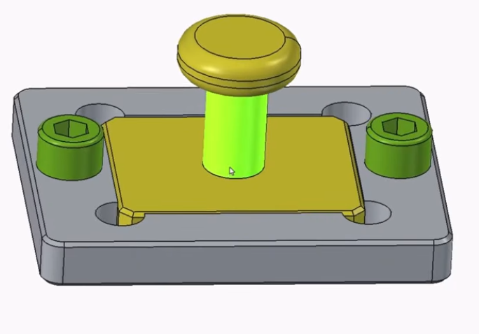

# Opgave 2026-2 Nr.: 1

* 
  * **Videoinspiration:** [FreeCAD 1.1: Laer hurtigt og begynd at modellere!](https://youtu.be/0A59LSY-IBY?list=PLW9dERE25pWSNQESKYOrJkS2IHOV31kjZ "ClickCAD")

## Opret Varset

* Varset:
  * Outline
    * X-Length:    100mm
    * Y-Length:     80mm
    * Z-Length:     12mm
    * Dia:           5mm
  * Corner Holes
    * CH_Diameter:  12mm
    * CH_X-Length:  30mm
    * CH_Y-Length:  25mm
  * Bolt Holes
    * BH_Diameter:  10,5mm
    * BH_X-Lewngth: 40mm

## Tegn som vist og sæt constraints med varset

* Åben Part Design
* Create New Body
  * Create New Sketch
* Sketch
  * 
* Pad
  * Pad Parameters
    * Length ***12,00 mm***
  * 
* Mirrored
  * Mirror Parameters
    * Transform: ***body***
    * Plane: ***Vertical base YZ-plane***
  * 
* Mirrored1
  * Mirror Parameters
    * Transform: ***body***
    * Plane: ***Vertical base XZ-plane***
  * 
* Fillet & Chamfer  
  * 

## Files

[Opgave_2026-2_1_Body.FCStd](./Opgave_2026-2_1_Body.FCStd)
