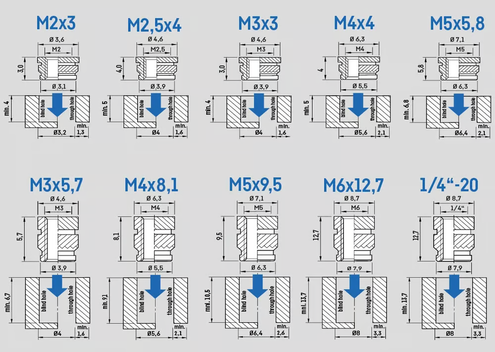

# Threaded inserts

## Kilder

* Prusa
  * [Threaded inserts - set standard 200 pcs](https://www.prusa3d.com/product/threaded-inserts-set-standard-200-pcs/)
  * [Soldering tips for threaded inserts](https://www.prusa3d.com/product/soldering-tips-for-threaded-inserts/)

||||
|:---:|:---:|:---:|
||||

## FreeCAD Hul offset måler

* 
* File:
  * [FreeCAD FCStd:](./FreeCAD_Test/FreeCAD-Test.FCStd)
  * [3mf file:](./FreeCAD_Test/FreeCAD-Test-Body.3mf)
  * [step file:](./FreeCAD_Test/FreeCAD-Test-Body.step)