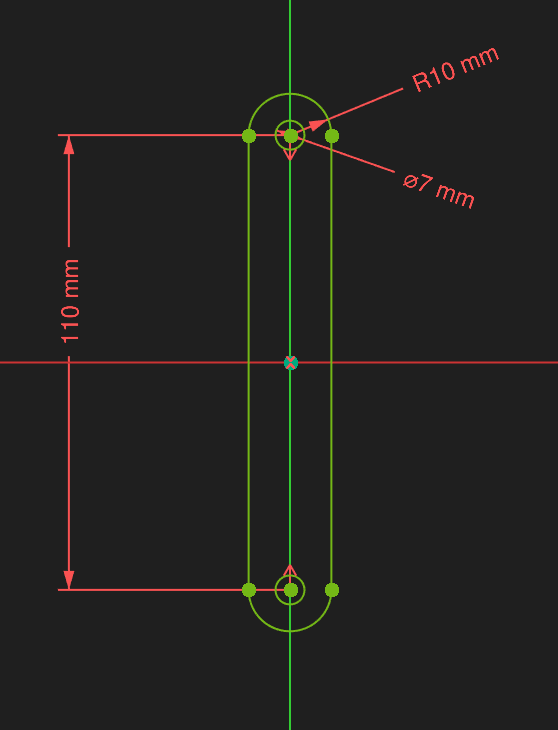

# FreeCAD 1.1 Beginners Friendly Modeling and Assembly (Model, Assemble, Simulate, Animate)

## Videoer

* MangoJelly Solutions for FreeCAD
  * [FreeCAD 1.1 Beginners Friendly Modeling and Assembly (Model, Assemble, Simulate, Animate)](https://youtu.be/wxxDahY1U6E)

## Parts

* Parts
  * Mastersketch
  * Body
    * LinkBody
    * CounterWeightBody
    * PistonHeadBody
    * MountBody
  * Assembly
    * Joints

## Dimensioner

## Tegneforløb

* Mastersketch i XY_Plane:
  * Video: [Creating the Master Sketch Step-by-Step](https://www.youtube.com/watch?v=wxxDahY1U6E&t=107s)
  * Sketcher
    * Tasks Settings:
      * 
      * 
    * Link Arm:
      * 
      * FreeCAD File: [001_MasterSketch.FCStd](./FreeCAD/001_MasterSketch_LinkArm.FCStd)
* Part Design
  * LinkBody
    * Sub Binder
      * View
        * Make Face: No
      * Data
        * Line Widt: 3,00
    * External Projection af Binder's LinkBody lines
      * Hide Binder
      * Resultat Binder & Pad:
        * 
        * FreeCAD File: [002_LinkBody.FCStd](./FreeCAD/002_LinkBody.FCStd)
  * CounterWeightBody
    * Sub Binder
      * View
        * Make Face: No
      * Data
        * Line Widt: 3,00
    * External Projection af Binder001's CounterWeightBody lines
      * Hide Binder001
      * Resultat Binder & Pad:
        * 
        * FreeCAD File: [003_CounterWeightBody.FCStd](./FreeCAD/003_CounterWeightBody.FCStd)
        
  * PistonHeadBody
    * Sub Binder
      * View
        * Make Face: No
      * Data
        * Line Widt: 3,00
    * External Projection af Binder002's PistonHeadBody lines
      * Hide Binder001
      * Resultat Binder & Pad:
        * 
        * FreeCAD File: 
  * MountBody
