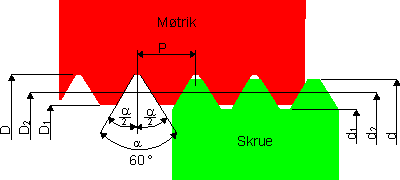

# Gevind med FreeCAD Fasteners Workbench

## Kilder

* [McMASTER-CARR](https://www.mcmaster.com/)
  * [Fastening & Joining](https://www.mcmaster.com/products/fastening-joining/)
  * [Pipe, Tubing, Hose & Fittings](https://www.mcmaster.com/products/pipe-tubing-hose-fittings/)
  * [Power Transmission](https://www.mcmaster.com/products/power-transmission/)
* [American Taper Pipe Threads](https://www.gewindebohrer.de/en/service/technische-daten/thread-type-npt)
  * Thread type: NPT - National Pipe Thread ANSI B 1.20.1
  * American Taper Pipe Thread - with sealant compound
* [Frylunds Fagteori](https://www.fagteori.dk/)
  * [ISO metrisk gevind M Tabel 1 -> 68mm klik her](https://www.fagteori.dk/maaling2/gevind-tabel-iso-metrisk.html)
  * 
* [Tom's useful info: Pitch Conversions](https://www.newmantools.com/tech/pitchconversions.htm)
  * Threads per inch, Pitch in inches, Pitch in mm
  * example 1/4-20" taps the 
    * 20 signifies "20 threads per inch" =.050 pitch ( 1 divided by 20 )
    * or if you are measuring in metric
    * it should be 1.27mm

### Frylunds Fagteori ISO metrisk gevind M Tabel 1 -> 68mm

|||||||
|:---:|:---:|:---:|:---:|:---:|:---:|
|Gevind-benævnelse M d=D|Stigning mm P|Dele-diameter mm d2=D2|Indv. diameter skrue d1|Indv. diameter møtrik D1|Gevindbor mm P-d P-D|
|M 1.00|0.25|0.838|0.693|0.729|0.75|
|M 1.10|0.25|0.938|0.793|0.829|0.85|
|M 1.20|0.25|1.038|0.893|0.929|0.95|
|M 1.40|0.30|1.205|1.032|1.075|1.10|
|M 1.60|0.35|1.373|1.171|1.221|1.25|
|M 1.80|0.35|1.573|1.371|1.421|1.45|
|M 2.00|0.40|1.740|1.509|1.567|1.60|
|M 2.20|0.45|1.908|1.648|1.713|1.75|
|M 2.50|0.45|2.208|1.948|2.013|2.05|
|M 3.00|0.50|2.675|2.387|2.459|2.50|
|M 3.50|0.60|3.110|2.764|2.850|2.90|
|M 4.00|0.70|3.545|3.141|3.242|3.30|
|M 4.50|0.75|4.013|3.580|3.688|3.80|
|M 5.00|0.80|4.480|4.019|4.134|4.20|
|M 6.00|1.00|5.350|4.773|4.917|5.00|
|M 7.00|1.00|6.350|5.773|5.917|6.00|
|M 8.00|1.25|7.188|6.466|6.647|6.80|
|M 9.00|1.25|8.188|7.466|7.647|7.80|
|M 10.00|1.50|9.026|8.160|8.376|8.50|
|M 11.00|1.50|10.026|9.160|9.376|9.50|
|M 12.00|1.75|10.863|9.853|10.106|10.20|
|M 14.00|2.00|12.701|11.546|11.835|12.00|
|M 16.00|2.00|14.701|13.546|13.835|14.00|
|M 18.00|2.50|16.376|14.933|15.394|15.50|
|M 20.00|2.50|18.376|16.933|17.294|17.50|
|M 22.00|2.50|20.376|18.933|19.294|19.50|
|M 24.00|3.00|22.051|20.319|20.752|21.00|
|M 27.00|3.00|25.051|23.319|23.752|24.00|
|M 30.00|3.50|27.727|25.706|26.211|26.50|
|M 33.00|3.50|30.727|28.706|29.211|29.50|
|M 36.00|4.00|33.402|31.093|31.670|32.00|
|M 39.00|4.00|36.402|34.093|34.670|35.00|
|M 42.00|4.50|39.077|36.479|37.129|37.50|
|M 45.00|4.50|42.077|39.479|40.129|40.50|
|M 48.00|5.00|44.752|41.866|42.857|43.00|
|M 52.00|5.00|48.752|45.866|46.587|47.00|
|M 56.00|5.50|52.428|49.252|50.046|50.50|
|M 60.00|5.50|56.428|53.252|54.046|54.50|
|M 64.00|6.00|60.103|56.639|57.505|58.00|
|M 68.00|6.00|64.103|60.639|61.505|62.00|

### Tom's useful info: Pitch Conversions

||||
|:---|:---|:---|
|Threads per inch|Pitch in inches|Pitch in mm|
|127|0.00787|0.200|
|120|0.00833|0.212|
|112|0.00893|0.227|
|101.6|0.00984|0.250|
|100|0.01000|0.254|
|96|0.01042|0.265|
|90|0.01111|0.282|
|84.67|0.01181|0.300|
|80|0.01250|0.318|
|72.57|0.01378|0.350|
|72|0.01389|0.353|
|64|0.01563|0.397|
|63.5|0.01575|0.400|
|60|0.01667|0.423|
|56.44|0.01772|0.450|
|56|0.01786|0.454|
|50.8|0.01969|0.500|
|48|0.02083|0.529|
|44|0.02273|0.577|
|42.33|0.02362|0.600|
|40|0.02500|0.635|
|36.29|0.02756|0.700|
|36|0.02778|0.706|
|34|0.02941|0.747|
|33.87|0.02952|0.750|
|32|0.03125|0.794|
|31.75|0.03150|0.800|
|30|0.03333|0.847|
|28.22|0.03544|0.900|
|28|0.03571|0.907|
|27|0.03704|0.941|
|26|0.03846|0.977|
|25.4|0.03937|1.000|
|24|0.04167|1.058|
|22|0.04545|1.155|
|20.32|0.04921|1.250|
|20|0.05000|1.270|
|19|0.05263|1.337|
|18|0.05556|1.411|
|16.93|0.05907|1.500|
|16|0.06250|1.588|
|14.51|0.06892|1.751|
|14|0.07143|1.814|
|13|0.07692|1.954|
|12.7|0.07874|2.000|
|12|0.08333|2.117|
|11.50|0.08696|2.209|
|11|0.09091|2.309|
|10.16|0.09843|2.500|
|10|0.10000|2.540|
|9|0.11111|2.822|
|8.47|0.11806|2.999|
|8|0.12500|3.175|
|7.26|0.13774|3.499|
|7|0.14286|3.629|
|6.35|0.15748|4.000|
|6|0.16667|4.233|
|5.64|0.17730|4.504|
|5.08|0.19685|5.000|
|5|0.20000|5.080|
|4.62|0.21645|5.498|
|4.5|0.22222|5.644|
|4.23|0.23641|6.005|
|4|0.25000|6.350|
|3|0.33333|8.467|
|2|0.50000|12.700|

### PTFE Push Fittings gevind [NPT](https://www.gewindebohrer.de/en/service/technische-daten/thread-type-npt)

||||||
|:---|:---|:---|:---|:---|
|| Major Diameter mm|Tapping Drill Size|TPI|Pitch P mm|
|NPT 1/8"|10,24|8,25|27,0|0,94|
|NPT 1/4"|13,62|10,70|18,0|1,41|