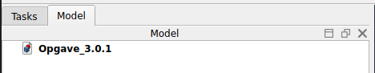
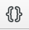
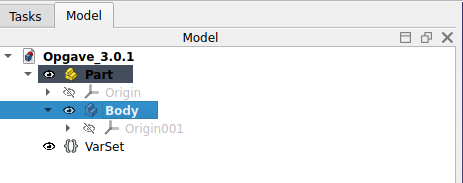
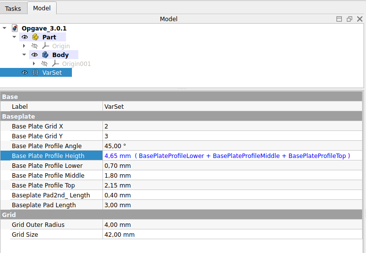
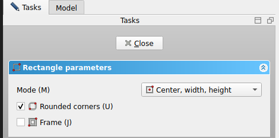
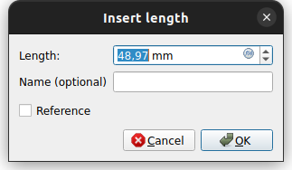
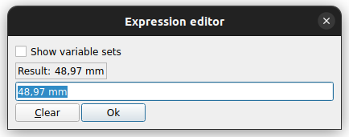

# Opgave 3.0.1 - Gridfinity Baseplate parametric modeling

## Step 1 - [Opret dokument](./Sketch/Opgave_3.0.1.FCStd)

* Start FreeCAD i Part Design
  * Gem opgaven med filnavnet i dit opgave directory
  * Vælg Model i Combo View
  * 
  * Klik på Create Part  vær nu sikker på at det **Create Part** du klikker på det er det **gule icon**, se en beskrivelsen af [Std Part](https://wiki.freecad.org/Std_Part)
  * Klik nu på **Creates a variable set** 
    * Klick [Cancel] for at komme tilbage.
  * Klik nu på **Create Body**, den blå icon 
  * Dit Model View skulle nu gerne se ud som herunder
  * 

## Step 2 - [Indsæt i VarSet](./Sketch/Opgave_3.0.2.FCStd)

* Til at opbevaring af vores parametric data vil jeg haer bruge [Std VarSet](https://wiki.freecad.org/Std_VarSet).
* [Klik her for at se mere om Std VarSet](https://wiki.freecad.org/Std_VarSet)
  * [Description](https://wiki.freecad.org/Std_VarSet#Description)
  * [Usage](https://wiki.freecad.org/Std_VarSet#Usage)
  * [Common property types](https://wiki.freecad.org/Std_VarSet#Common_property_types)
  * [Notes](https://wiki.freecad.org/Std_VarSet#Notes)
* [Mere om Property editor](https://wiki.freecad.org/Property_editor)
  * [Introduction](https://wiki.freecad.org/Property_editor#Introduction)
  * [Property types](https://wiki.freecad.org/Property_editor#Property_types)
  * [View and Data properties](https://wiki.freecad.org/Property_editor#View_and_Data_properties)
  * [Basic properties](https://wiki.freecad.org/Property_editor#Basic_properties)
  * [Context menu](https://wiki.freecad.org/Property_editor#Context_menu)

|Name|Group|Type|Value|
|:---|:---|:---|---:|
|GridSize|Grid|App::PropertyLength|42,00mm|
|GridOuterRadius|Grid|App::PropertyLength|4,00mm|
|||||
|BaseplatePadLength|Baseplate|App::PropertyLength|3,00mm|
|BaseplatePad2nd_Length|Baseplate|App::PropertyLength|0,40mm|
|||||
|BasePlateProfileLower|Baseplate|App::PropertyLength|0,70mm|
|BasePlateProfileMiddle|Baseplate|App::PropertyLength|1,80mm|
|BasePlateProfileTop|Baseplate|App::PropertyLength|2,15mm|
|BasePlateProfileHeigth|Baseplate|App::PropertyLength|2,15mm|
|BasePlateProfileAngle|Baseplate|App::PropertyAngle|45,00 deg|
|||||
|BasePlateGridX|Baseplate|App::PropertyInteger|2|
|BasePlateGridY|Baseplate|App::PropertyInteger| 3|

* Double klik nu på **{} VarSet** i Model View
  * Tilføj nu værdierne som listet herover, sikre dig at Navn, Group & Type er korrekte
  * klik igen på VarSet og tilføj Value
  * Dit Model View skulle nu gerne se ud som herunder
*  

## Step 3 - [Tegn Baseplate 1. trin - Opret Sketchs](./Sketch/)

* Klik nu på **Create Sketch**   
  * Vælg XY-plane001 (Base plane)
    * Klik [OK]
    * Vælg nu tegne værktøjet **Centered rectangle** 
      * Start tergnigen i nulpunket.
      * du skulle nu have en figur som her
      * 
      * Klik ComboView -> Task [Close]
* Klik nu på **Create Sketch**   
  * Vælg XY-plane001 (Base plane)
    * Klik [OK]
    * Vælg nu tegne værktøjet **Centered rectangle** 
    * Select **Rounded corners**
    * 
      * Start tergnigen i nulpunket.
      * Tegn nu en firkant, klik og ryk lidt tilbage så der kommer runde hjørner.
      * du skulle nu have en figur som her
      * 
      * Klik ComboView -> Task [Close]
* Klik nu på **Create Sketch**   
  * Vælg XZ-plane001 (Base plane)
    * Klik [OK]
    * Vælg nu tegne værktøjet **Create Polyline** 
      * Tegn en tegning som vist herunder:
      * 
      * Klik ComboView -> Task [Close]
* I ComboView -> Model Klik på Body
  * Klik [F2] for at omdøbe Body til Baseplate
  * Du skal nu have noget der ser ud som herunder
  * 

## Step 4 - [Constraint Sketchs](./Sketch/)

* [Sketcher Workbench](https://wiki.freecad.org/Sketcher_Workbench)
  * [Constraints](https://wiki.freecad.org/Sketcher_Workbench#Constraints)
* Constraint Sketch, 
  * Dobbeltklik på ConboView -> Model -> Sketch
  * 
  * for at åbne Sketch i Sketcher.
    * Selct en lodret og vandret linie og tryk på  eller [E], for at sætte dem til samme længde, du skulle nu se en kvardrat.
    * Klik på den vandrette linie for at sætte længden og Klik [L]
      * Insert Length vindue åbner 
      *
      * Klik nu på den lille globus og Expression Editor windue åbner
      * 
      * Indtast nu 'VarSet.GridSize', og du skal se at Result: 42,00mm
      * 
      * Klik [OK], [Ok] og [Close]

  * Dobbeltklik på ConboView -> Model -> Sketch001
  * for at åbne Sketch001 i Sketcher.
    * Selct en lodret og vandret linie og tryk på  eller [E], for at sætte dem til samme længde, du skulle nu se en kvardrat.
    * Klik på et af de krumme hjørner og tryk [D]
      * Insert radius vindue åbner
      * Klik nu på den lille globus og Expression Editor windue åbner
      * Indtast nu 'VarSet.GridOuterRadius', og du skal se at Result: 4,00mm
      * Klik [OK], [Ok]
    * Klik på [External geometry](https://wiki.freecad.org/Sketcher_External)  
      * select den nederste vandrett linie i Sketch (kavdraten), det skal nu se ud som herunder
      * 
    * Select nu den stiplede linie og punktet med pilen i nederste højre runde hjørne og klik på [Coincident](https://wiki.freecad.org/Sketcher_ConstrainCoincidentUnified)  eller [C], herunder ser du hvardan resultatet bør se ud
    * 
    * Klik [Close]

 