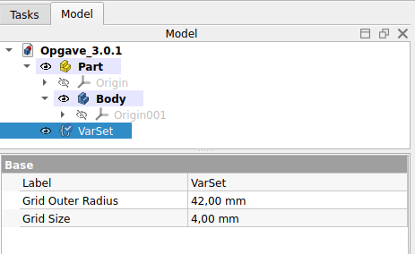

# Opgave 3.0.1 - Gridfinity Baseplate parametric modeling

## VarSet

Til at opbevaring af vores parametric data vil jeg haer bruge [Std VarSet](https://wiki.freecad.org/Std_VarSet).

* [Klik her for at se mere om FreeCAD Std VarSet](https://wiki.freecad.org/Std_VarSet)
  * Vigtig læsning er afsnittene:
    * Description
    * Usage

### VarSet Grid parameter

|Name|Group|Type|Value|
|:---|:---|:---|---:|
|GridSize|Grid|App::PropertyLength|42,00mm|
|GridOuterRadius|Grid|App::PropertyLength|4,00mm|

### VarSet Baseplate parameter

|Name|Group|Type|Value|
|:---|:---|:---|:---|
|BaseplateWidth|Baseplate|App::PropertyLength|VarSet.GridSize|
|BaseplateRadius|Baseplate|App::PropertyLength|VarSet.GridOuterRadius|
|||||
|BaseplatePadLength|Baseplate|App::PropertyLength|3,00mm|
|BaseplatePad2nd_Length|Baseplate|App::PropertyLength|0,40mm|
|||||
|BasePlateProfileLower|Baseplate|App::PropertyLength|0,70mm|
|BasePlateProfileMiddle|Baseplate|App::PropertyLength|1,80mm|
|BasePlateProfileTop|Baseplate|App::PropertyLength|2,15mm|
|BasePlateProfileHeight|Baseplate|App::PropertyLength|2,85mm|
|BasePlateProfileAngle|Baseplate|App::PropertyAngle|45,00 deg|
|||||
|BasePlateGridX|Baseplate|App::PropertyInteger|2|
|BasePlateGridY|Baseplate|App::PropertyInteger| 3|

### VarSet  Bins/Blocks parameter

|Group|Name|Type|Value|
|:---|:---|:---|:---|
|GridOffset|Grid|App::PropertyLength|0,25mm|
|BinBlocks|BinBlocks_Pad_X|App::PropertyLength|(VarSet.Grid_Size * BinBlocks_Grid_X) - VarSet.Grid_Bin_Offset|
|BinBlocks|BinBlocks_Pad_Y|App::PropertyLength|(VarSet.Grid_Size * BinBlocks_Grid_Y) - VarSet.Grid_Bin_Offset|
|BinBlocks|BinBlocks_Pad_Z|App::PropertyLength|VarSet.Grid_Size - VarSet.Grid_Bin_Offset|
|BinBlocks|BinBlocks_Pad_Top_Height|App::PropertyLength|21,00mm|
|||||
|BinBlocks|BinBlocks_Profile_Lower|App::PropertyLength|Varset.BasePlate_Profile_Lower + 0,1mm|
|BinBlocks|BinBlocks_Profile_Middle|App::PropertyLength|1,80mm|
|BinBlocks|BinBlocks_Profile_Top|App::PropertyLength|2,15mm|
|BinBlocks|BinBlocks_Profile_Height|App::PropertyLength|2,95mm|
|BinBlocks|BinBlocks_Profile_Angle|App::PropertyAngle|45,00 deg|
|||||
|BinBlocks|BinBlocks_Grid_X|App::PropertyInteger|1|
|BinBlocks|BinBlocks_Grid_Y|App::PropertyInteger|1|

## Opgaven 3.0.1

### Step 1 - Opret dokument

* Start FreeCAD i Part Design
  * Gem opgaven med filnavnet i dit opgave directory
  * Vælg Model i Combo View
  * 
  * Klik på Create Part  vær nu sikker på at det **Create Part** du klikker på det er det **gule icon**, se en beskrivelsen af [Std Part](https://wiki.freecad.org/Std_Part)
  * Klik nu på **Creates a variable set** 
    * Klick [Cancel] for at komme tilbage.
  * Klik nu på **Create Body**, den blå icon 
  * Dit Model View skulle nu gerne se ud som herunder
  * 

### Step 2 -  Indset i VarSet

* Double klik nu på **{} VarSet** i Model View
  * Tilføj nu værdierne som listet herunder, sikre dig at Navn, Group & Type er korrekte
  * klik igen på VarSet og tilføj Value
  * Dit Model View skulle nu gerne se ud som herunder
  * 

|Name|Group|Type|Value|
|:---|:---|:---|---:|
|GridSize|Grid|App::PropertyLength|42,00mm|
|GridOuterRadius|Grid|App::PropertyLength|4,00mm|
|||||
|BaseplatePadLength|Baseplate|App::PropertyLength|3,00mm|
|BaseplatePad2nd_Length|Baseplate|App::PropertyLength|0,40mm|
|||||
|BasePlateProfileLower|Baseplate|App::PropertyLength|0,70mm|
|BasePlateProfileMiddle|Baseplate|App::PropertyLength|1,80mm|
|BasePlateProfileTop|Baseplate|App::PropertyLength|2,15mm|
|BasePlateProfileAngle|Baseplate|App::PropertyAngle|45,00 deg|
|||||
|BasePlateGridX|Baseplate|App::PropertyInteger|2|
|BasePlateGridY|Baseplate|App::PropertyInteger| 3|

### Step 3 - Tegn Baseplate 1. trin

* Klik nu på **Create Sketch** 
    * Klik [OK]
  * Vælg nu tegne værktøjet **Centered rectangle** 
    * Start tergnigen i nulpunket.
      * Tegn nu en firkant, klik og ryk lidt tilbage så der kommer runde hjørner.
      * du skulle nu have en figur som her
      * 

### Step 3 - Tegn Baseplate 2. trin

    * Select **Rounded corners**
    * 
      * 
