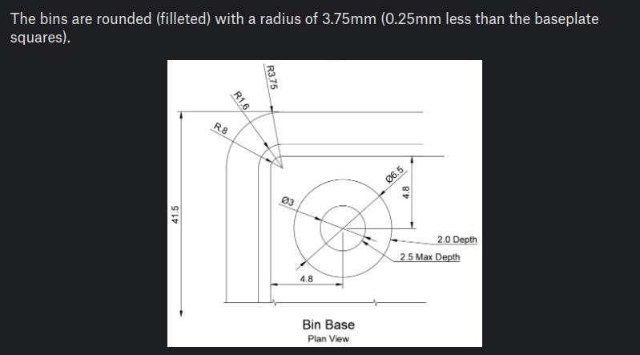

# Opgave 3.0 - Gridfinity

## Kilder

* [Printables]()
  * [Gridfinity Specification](https://www.printables.com/model/417152-gridfinity-specification "grizzie17")
  * [Rugged Box (Parametric)](https://www.printables.com/model/258431-rugged-box-parametric "Whity")
* [Kursus Videoer](https://www.youtube.com/@sekt1953)
  * [GridFinityParametricFiles - BasePlate](https://youtu.be/zOC_qxB1Kig)
* Youtube Videoer
  * [GridFinity Parametric File #freecad #cad #design](https://youtu.be/rAv9zGpiyvw "Adventures in creation")
  * [Underware: The Ultimate Cable Management System | Full Guide](https://youtu.be/0TT96b98YZY?list=PLFa9atYEuNhVEwJW1WDg2C_DJdGSHJGrQ "Hands On Katie")
  * [gridfinity case with bins](https://www.youtube.com/watch?v=hjQqcGHjv50 "Jason Brain")

## [Data](https://www.printables.com/model/417152-gridfinity-specification)

||Baseplate|BinBase|
|:---:|:---:|:---:|
|Profile|||
|View|||

## VarSet

### Gridfinity Parameters

|Name|Group|Type|Value|
|:---|:---|:---|---:|
|GridSize|Gridfinity|App::PropertyLength|42,00mm|
|GridOuterRadius|Gridfinity|App::PropertyLength|4,00mm|
|||||
|ProfileAngle|Gridfinity|App::PropertyAngle|45,00 deg|
|ProfileTop|Gridfinity|App::PropertyLength|2,15mm|
|ProfileMiddle|Gridfinity|App::PropertyLength|1,80mm|
|BaseProfileOffset_Z|Gridfinity|App::PropertyLength|-0,10mm|
|BaseProfileLower|Gridfinity|App::PropertyLength|0,70mm|
|||||
|BinProfileOffset_XY|Gridfinity|App::PropertyLength|0,25mm|
|BinProfileLower|Gridfinity|App::PropertyLength|0,80mm|
|BinStepSize|Gridfinity|App::PropertyLength|7,00mm|

### BasePlate Parameters

|Name|Group|Type|Value|
|:---|:---|:---|---:|
|BasePlateGridX|Baseplate|App::PropertyInteger|2|
|BasePlateGridY|Baseplate|App::PropertyInteger|3|
|||||
|BasePlateProfileHeigth|Baseplate|App::PropertyLength|ProfileTop +  ProfileMiddle + BaseProfileLower|

### BinBase Parameters

|Name|Group|Type|Value|
|:---|:---|:---|:---|

### BinBasket Parameters

|Name|Group|Type|Value|
|:---|:---|:---|:---|
|BinBasketGridX|Bin|App::PropertyInteger|1|
|BinBasketGridY|Bin|App::PropertyInteger|3|
|||||
|BinBasketProfile_Z|Bin|App::PropertyInteger|2|
|BinBasketProfileHeigth|Baseplate|App::PropertyLength|(BinStepSize * BinBasketProfile_Z) - (ProfileTop + ProfileMiddle + BinProfileLower)|
|||||
|BinBasket_WidthX|BinBasket|App::PropertyLength|GridSize * BinBasket_GridX - 2 * BinOffset_Horzontal|
|BinBasket_LengthY|BinBasket|App::PropertyLength|GridSize * BinBasket_GridY - 2 * BinOffset_Horzontal|
|||||
|BinBasket_Height|BinBasket|App::PropertyLength|21,00mm|
|BinBasket_Wall|BinBasket|App::PropertyLength|1,50mm|
