# Opgave 3.1.1 - Gridfinity Binplate parametric modeling

## Kilder

* [Printables]()
  * [Gridfinity Specification](https://www.printables.com/model/417152-gridfinity-specification "grizzie17")
  * [Rugged Box (Parametric)](https://www.printables.com/model/258431-rugged-box-parametric "Whity")
* [Kursus Videoer](https://www.youtube.com/@sekt1953)
  * [GridFinityParametricFiles - BasePlate](https://youtu.be/zOC_qxB1Kig)
* Youtube Videoer
  * [GridFinity Parametric File #freecad #cad #design](https://youtu.be/rAv9zGpiyvw "Adventures in creation")
  * [Underware: The Ultimate Cable Management System | Full Guide](https://youtu.be/0TT96b98YZY?list=PLFa9atYEuNhVEwJW1WDg2C_DJdGSHJGrQ "Hands On Katie")
  * [gridfinity case with bins](https://www.youtube.com/watch?v=hjQqcGHjv50 "Jason Brain")

## [Data](https://www.printables.com/model/417152-gridfinity-specification)

|BinBase Profile|BinBase Plane View|
|:---:|:---:|
|||

## Step 1 - [Åben dokument - PartDesign Workbench](https://wiki.freecad.org/PartDesign_Workbench)

* File 
  * Open dokument
    * Opgave_3.0.FCStd
  * Gem dokument as
    * Opgave_3.1.1.FCStd
* Create Body
  * Klik på iconen 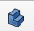
  * Omdøb den ny **Body** til **Bin**
* Du skal nu se noget som herunder:
  * 

## Step 2 - Indsæt data for BinBaseProfile i VarSet

|Name|Group|Type|Value|
|:---|:---|:---|:---|
|BinBase_Grid_Offset|Bin|App::PropertyLength|0,25mm|
|BinBase_Profile_Lower|Bin|App::PropertyLength|0,80mm|
|BinBase_Profile_Middle|Bin|App::PropertyLength|1,80mm|
|BinBase_Profile_Top|Bin|App::PropertyLength|2,15mm|
|BinBase_Profile_Height|Bin|App::PropertyLength|mm|
|BinBase_Profile_Angle|Bin|App::PropertyAngle|45,00 deg|
|||||
|BinBase_Grid_X|Bin|App::PropertyInteger|1|
|BinBase_Grid_Y|Bin|App::PropertyInteger|1|

* Double klik nu på **{} VarSet** i Model View
  * Tilføj nu værdierne som listet herover, sikre dig at Navn, Group & Type er korrekte
  * klik igen på VarSet og tilføj Value
  * Dit Model View skulle nu gerne se ud som herunder
* 

### Step 3 - Tegn BinBase

* Skjul Baseplate
  * ComboView -> Model -> Baseplate
    * Tryk på mellemrums tangenten for at skjule Baseplate
* Klik nu på **Create Sketch** 
  * Vælg XY-plane001 (Base plane)
    * Klik [OK]
  * Vælg nu tegne værktøjet **Centered rectangle** 
    * Start firkant med runde hjørner i nulpunket.
      * Tegn nu en firkant, klik og ryk lidt tilbage så der kommer runde hjørner.
    * Sæt Radius på hjørnerne
      * Marker et en hjørne kurve og tryk [D]
        * Insert radius vindue åbner
        * Klik nu på den lille globus og Expression Editor windue åbner
        * Indtast nu 'VarSet.GridOuterRadius - VarSet.BinBase_Grid_Offset', og du skal se at Result: 3,75mm
        * Klik [OK], [Ok]
      * du skulle nu have en figur som her
      * 
    * Sæt bredde på firkanten
      * Market de to yderste punkter på de nederste runde hjørner og Tryk [L]
        * Insert length vindue åbner
        * Klik nu på den lille globus og Expression Editor windue åbner
        * Indtast nu 'VarSet.GridSize - 2 * VarSet.BinBase_Grid_Offset', og du skal se at Result: 41,50mm
        * Klik [OK], [Ok]
      * du skulle nu have en figur som her
      * 
        * Klik [Close]

### Step 4 - Tegn BinBaseProfile

* Klik nu på **Create Sketch** 
  * Vælg XZ-plane001 (Base plane)
    * Klik [OK]
  * Vælg nu tegne værktøjet **** 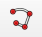
    * Tegn en tegning som vist herunder:
    * 
      * Check at de 2 lodrette linier i Sketch004 er lodrette, der skal være en lille rød strg tæt ved dem, hvis ikke så klik på dem en afgangen og tast [v] for vertical constrain
      * på samme måde se efter om den vandretet linie har en rød streg, hvis ikke så vælg linien og klik på [H] for horizontal constrain.
      * Hold [Ctrl] nede og select de to Skrå Linier og klik på [P] for Parallel constrain, din figur skal nu se ud som herunder:
    * 

### Step 5 - Constrain BinBaseProfile

* Nu skal vi indsætte mål på tegningen
  * Klik på den nederste skrå linies endepunkter
    * Tast [I] for lodret højde, **Insert Length** vinduet åbner
      * 
      * Klik nu på den lille globus og **Expression Editor** winduet åbner
      * 
      * Indtast nu **'VarSet.BinBase_Profile_Lower'**
        * Result: 0,80mm
    * Klik [OK], [Ok]
  * Klik på den korte lodrette linies endepunkter
    * Tast [I] for lodret højde, **Insert Length** vinduet åbner
      * 
      * Klik nu på den lille globus og **Expression Editor** winduet åbner
      * 
      * Indtast nu **'VarSet.BinBase_Profile_Middle'**
        * Result: 1,80mm
    * Klik [OK], [Ok]
  * Klik på den Øverste skrå linies endepunkter
    * Tast [I] for lodret højde, **Insert Length** vinduet åbner
      * 
      * Klik nu på den lille globus og **Expression Editor** winduet åbner
      * 
      * Indtast nu **'VarSet.BinBase_Profile_Top'**
        * Result: 2,15mm
    * Klik [OK], [Ok]
  * Klik på den Øverste skrå linie, derefter på den vandrette linie, 
    * Tast [K] efterfult af [A], **Insert angle** vinduet åbner
      * 
      * Klik nu på den lille globus og **Expression Editor** winduet åbner
      * 
      * Indtast nu **'VarSet.Grid_Grid_Profile_Angle'**, og du skal se at Result: 45,00 deg.
      * 
    * Klik [OK], [Ok]

### Step 6 - BinBaseProfile Lås Sketch005 til Sketch004

* Tryk [0] for Isometric View og zoom in så du ser noget som herunder:
  * 
  * Klik  
    * Klik nu på den linie i Sketch004 som krydser X-axis
    * det skal se ud som herunder
    * 
* Tryk [1] og zoom så du ser noget som herunder
  * 
    * Marker den vandrette linies højre endpunkt, og derefter marker set det punkt vi oprettede med external geometri
      * Tast [V] for vertical constrain
    * Marker Profilens nederste punkt, og derefter marker set det punkt vi oprettede med external geometri
    * Tast [H] for horizontal constrain
    * 
    * Klik på [0] for at vælge Isometric View
    * Klik [Close]
  * 

### Step 7 - BinBaseProfile - Additive Pipe

* Åben ComboView -> Model 
  * Marker **Sketch005** og derefter **Sketch004**, rækkefølgende er **vigtig!**
  * 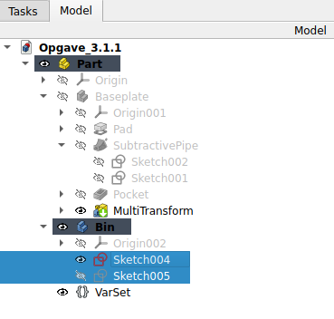
  * Klik nu på AdditivePipe iconet 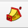
    * Task vinduet åbener og en AdditivePipe figur viser 
    * 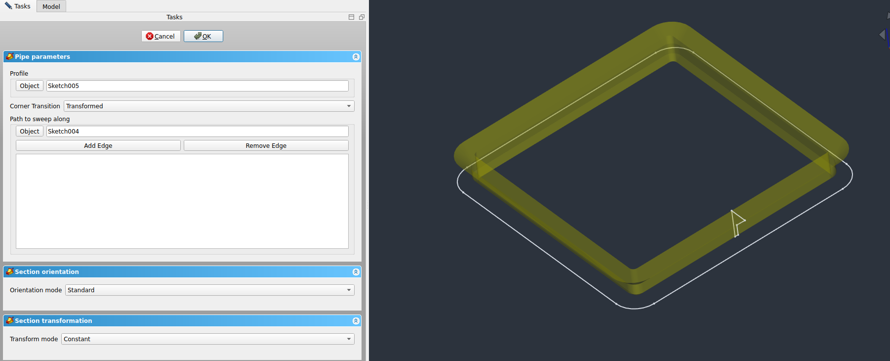
    * Klik [OK] i task vinduet, en AdditivePipe figur er nu oprettet.
  * 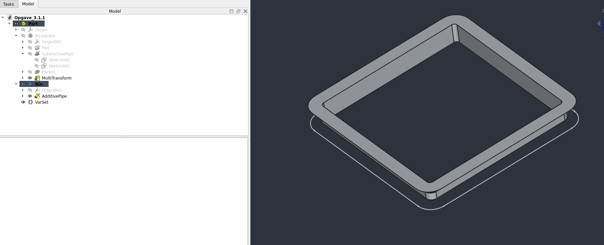  

### Step 8 - BinBaseProfile - udfyld hulrummet i den lige oprettet AdditivePipe

* Tryk [V,3] for Draw style: Wireframe
  * Opret en ny Sketch i XY-plane
  * Brug CreateExternalGeometry  til 
    * Klik på nederste venste inderste hjørne 
    * 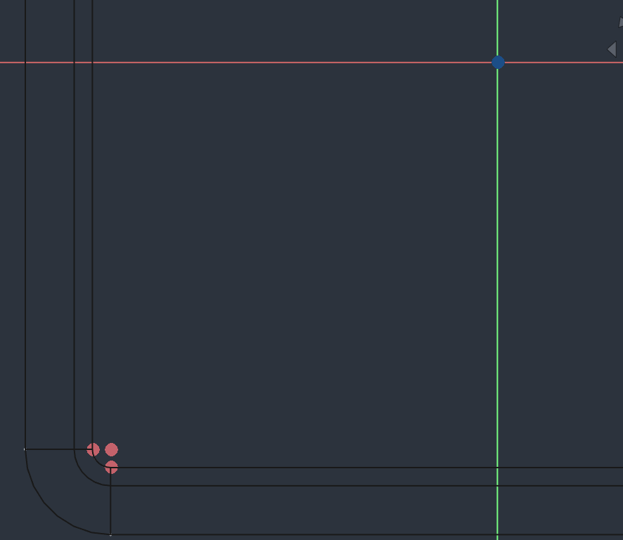
  * Tegn nu en Centered Firkant med Runde hjørner 
    * Start i tegningens nulpunkt
      * 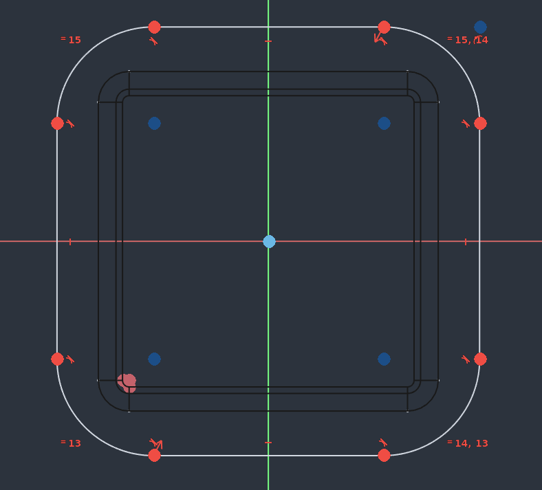
    * Marker de 2 kurver centrum, og Constrain dem ved at trykke [C]
      * 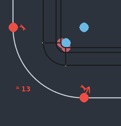
    * Marker nu et end punk for den inderste og det nye hjørne
      * 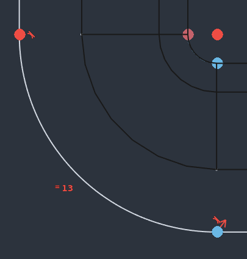
    * Constrain dem ved at trykke [H]
* Tryk [V,1] for Draw style: As Is
  * Marker Sketch006 og Pad Sketchen
    * 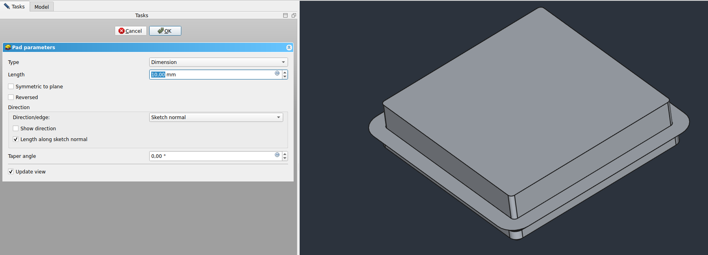
    * Ændre værdien for Lenght ved at trykke på den lille globus
    * Indtaste i **'VarSet.Bin_BinBase_Profile_Height'** i Expression editor vinduet
      * Result skal være 4,75 mm
    Klik [OK], [Ok]
    * Skal nu have en figur som herunder:
      * 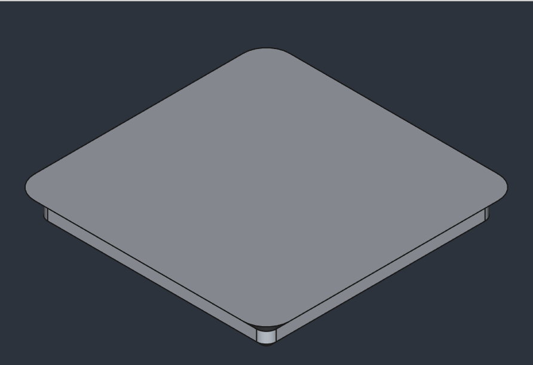
  * Her resultatet af Step 8
    * i ComboView -> Model Marker Baseplate og Tryk mellemrums tangenter for at gøre den synlig
    * Højre klik på Baseplate og klik Toggle Transparency  til On
    * Højre klik på Bin og vælg klik på Random color.
    * 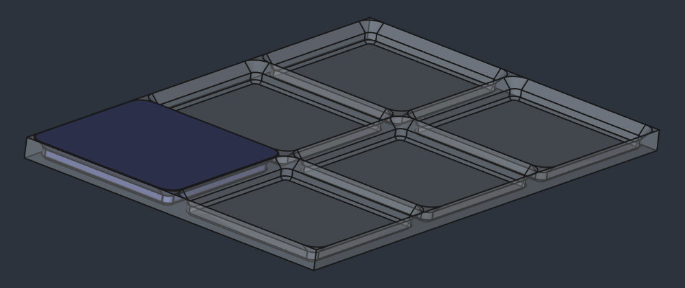  

## Step 9 - Indsæt data for BinBasket i VarSet

|Name|Group|Type|Value|
|:---|:---|:---|:---|
|BinBasket_Grid_X|BinBasket|App::PropertyInteger|1|
|BinBasket_Grid_Y|BinBasketBin|App::PropertyInteger|2|

* Double klik nu på **{} VarSet** i Model View
  * Tilføj nu værdierne som listet herover, sikre dig at Navn, Group & Type er korrekte
  * klik igen på VarSet og tilføj Value
  * Dit Model View skulle nu gerne se ud som herunder
* 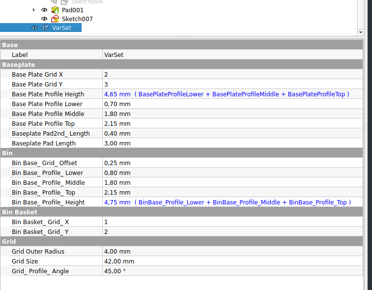

## Step 10 - Tegn BinBasket 

* Opret en ny Sketch i XY-Plane 
  * Klik ViewSection iconet 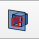
  * Tegn nu Firkant med Runde hjørner brug 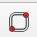

(VarSet.GridSize - 2 * VarSet.BinBase_Grid_Offset) * VarSet.BinBasket_Grid_X
(VarSet.GridSize - 2 * VarSet.BinBase_Grid_Offset) * VarSet.BinBasket_Grid_Y
