# Opgave 3 - Gridfinity

## VarSet Data

|**Gridfinity Parameters:**||||
|:---|:---|:---|---:|
|Name|Group|Type|Value|
|GridSize|Gridfinity|App::PropertyLength| 42,00 mm|
|GridOuterRadius|Gridfinity|App::PropertyLength| 4,00 mm|
|**Gridfinity Profile:**||||
|GridProfileAngle|Gridfinity|App::PropertyAngle|45,00 deg|
|GridProfileTop|Gridfinity|App::PropertyLength| 2,15 mm|
|GridProfileMiddle|Gridfinity|App::PropertyLength| 1,80 mm|
|||||
|GridProfileBaseplateLower|Gridfinity|App::PropertyLength| 0,70 mm|
|GridProfileBaseplateHeight|Gridfinity|App::PropertyLength| GridProfileTop + GridProfileMiddle + GridProfileBaseplateLower|
|||||
|GridProfileBinLower|Gridfinity|App::PropertyLength| 0,80 mm|
|GridProfileBinplateHeight|Gridfinity|App::PropertyLength| GridProfileTop +GridProfileMiddle + GridProfileBinLower|
|GridProfileBinTopRadius|Gridfinity|App::PropertyLength| 5,00 mm|
|||||
|**BasePlate Parameters:**|||***2 x 3 Grid***|
|BasePlateGridX|Baseplate|App::PropertyInteger|2|
|BasePlateGridY|Baseplate|App::PropertyInteger|3|
|||||
|**BinBasket Parameters:**|||***1 x 1 Grid***|
|BinPlateGridX|Baseplate|App::PropertyInteger|1|
|BinPlateGridY|Baseplate|App::PropertyInteger|1|
|**BinBasket Parameters:**|||***1 x 3 Grid***|
|BinPlateGridX|Baseplate|App::PropertyInteger|1|
|BinPlateGridY|Baseplate|App::PropertyInteger|3|
|**BinBasket Parameters:**|||***2 x 3 Grid***|
|BinPlateGridX|Baseplate|App::PropertyInteger|2|
|BinPlateGridY|Baseplate|App::PropertyInteger|3|

## Step1: Opret 1 Part, 4 Body & 1 VarSet

* Åben FreeCAD i **Part Design**
  * Gem FreeCAD File: **File -> SaveAs** i ***~/DataStuen41/Opgaver/Opgave_3/Opgave_3.FCStd***
* Model View:
  * Klik på Iconet **Create Part** 
  * BasePlate:
    * Klik på Iconet **Create Body** 
      * Klik på [F2] for at omdøbe **Body** til ***BasePlateProfile***
    * Klik på Iconet **Create Body** 
      * Klik på [F2] for at omdøbe **Body** til ***BasePlateFoot***
  * Bin:
    * Klik på Iconet **Create Body** 
      * Klik på [F2] for at omdøbe **Body** til ***BinBaseFoot***
    * Klik på Iconet **Create Body** 
      * Klik på [F2] for at omdøbe **Body** til ***BinBasket***
  * VarSet
    * Marker **ComboView -> Model -> Opgave_3 -> Part**
      * Klik på Iconet **Varset** 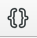
      * Klik [Cancel]
* 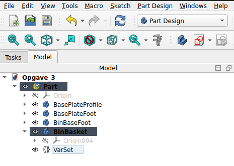

## Step 2: Tegn BasePlateProfile

### Step 2.1 Indtast VarSet for Baseplate

* DobbeltKlik på **ComboView -> Opgave_3 -> Part -> BasePlateProfile** så BasePlateProfile bliver det Aktive Body.
  * Klik på Iconet **Create Sketch** 
    * DobbeltKlik **ComboView -> Task -> XZ-plane001 (Base plane)**
    * VarSet:
      * DobbeltKlik **ComboView -> Model -> VarSet**
      * Select: *Add another*
        * Indtast:
          * Name: GridSize
          * Group: Gridfinity
          * Type: App::PropertyLength
          * Value: 42,00 mm
          * Klik [Ok]
        * Indtast:
          * Name: GridOuterRadius
          * Group: Gridfinity
          * Type: App::PropertyLength
          * Value: 4,00 mm
          * Klik [Ok]
        * Indtast:
          * Name: GridProfileAngle
          * Group: Gridfinity
          * Type: App::PropertyAngle
          * Value: 45,00 deg
          * Klik [Ok]
        * Indtast:
          * Name: GridProfileTop
          * Group: Gridfinity
          * Type: App::PropertyLength
          * Value: 2,15 mm
          * Klik [Ok]
        * Indtast:
          * Name: GridProfileMiddle
          * Group: Gridfinity
          * Type: App::PropertyLength
          * Value: 1,80 mm
          * Klik [Ok]
        * Indtast:
          * Name: GridProfileBaseplateLower
          * Group: Gridfinity
          * Type: App::PropertyLength
          * Value: 0,70 mm
          * Klik [Ok]
        * Indtast:
          * Name: GridProfileBaseplateHeight
          * Group: Gridfinity
          * Type: App::PropertyLength
          * Klik [Ok]
        * **HøjreKlik ComboView -> Model -> Gridfinity -> Grid Profile Baseplate Height**
          * Klik **Expression...** og Expression editor åbner
          * 
            * Indtsat nu **GridProfileTop + GridProfileMiddle + GridProfileBaseplateLower**
              * Result: 4,65
            * Klik [Ok]
* 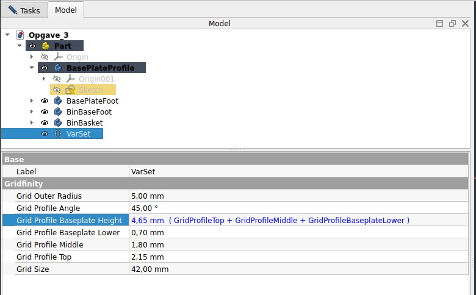

### Step 2.2: Tegn BasePlate CutOut Profile

* Omdøb **Sketch** til ***BasePlateProfileCutOut***
* DobbeltKlik på **ComboView -> Opgave_3 -> Model -> BasePlateProfileCutOut** for at åbne Sketch for i edit mode
  * Tegn figur som vist herunder
  * 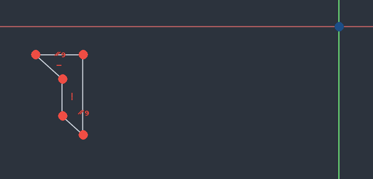
  * Klik Ikonet **Constrain Horizontal/vertical** 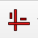 eller klik **[A]**, Constrain nu lodret og vandrette linier.
  * Klik Ikonet **Constrain parallel**  eller klik **[P]**, og Constrain nu de to skrå linier.
  * Klik på en Ikonet **Dimension**  eller Klik [D]
    * Indsæt GridProfileAngle
      * klik på en vandret & skrå linie, Vinduet **insert Angle** åbner, Klik den lille Globus og **Expression editor** vinduet åbner
      * 
      * Indtast nu **VarSet.GridProfileAngle**
        * Result skal være: 45,00 deg
      * Klik [Ok], [Ok]
    * Indsæt GridProfileTop
      * Klik endpunkter for den øverste skrå linie
        * Vælg det lodrette mål, Klik **Insert length** vinduet åbenr
      * Klik den lille Globus og **Expression editor** vinduet åbner
      * 
      * Indtast nu **VarSet.GridProfileTop**
        * Result skal være: 2,15 mm
      * Klik [Ok], [Ok]
    * Indsæt GridProfileMiddle
      * Klik nederste endpunkt for den øverste skrå linie, og det øverste endpunkt af den nederste skrå linie
        * Vælg det lodrette mål, Klik **Insert length** vinduet åbenr
      * Klik den lille Globus og **Expression editor** vinduet åbner
      * 
      * Indtast nu **VarSet.GridProfileMiddle**
        * Result skal være: 1,80 mm
      * Klik [Ok], [Ok]
    * Indsæt GridProfileBaseplateLower
      * Klik øverste endpunkt for den nesderste skrå linie, og det øverste endpunkt af den nederste skrå linie
        * Vælg det lodrette mål, Klik **Insert length** vinduet åbenr
      * Klik den lille Globus og **Expression editor** vinduet åbner
      * 
      * Indtast nu **VarSet.GridProfileBaseplateLower**
        * Result skal være: 0,70 mm
      * Klik [Ok], [Ok]
    * Indsæt GridSize
      * Klik øverste linies højre endpunkt og Sketchens nulpunket
        * Vælg det lodrette mål, Klik **Insert length** vinduet åbenr
      * Klik den lille Globus og **Expression editor** vinduet åbner
      * 
      * Indtast nu **VarSet.GridSize / 2**
        * Result skal være: 21,00 mm
      * Klik [Ok], [Ok]
      * HøjreKlik for at komme ud af Constrain Dimensions
    * 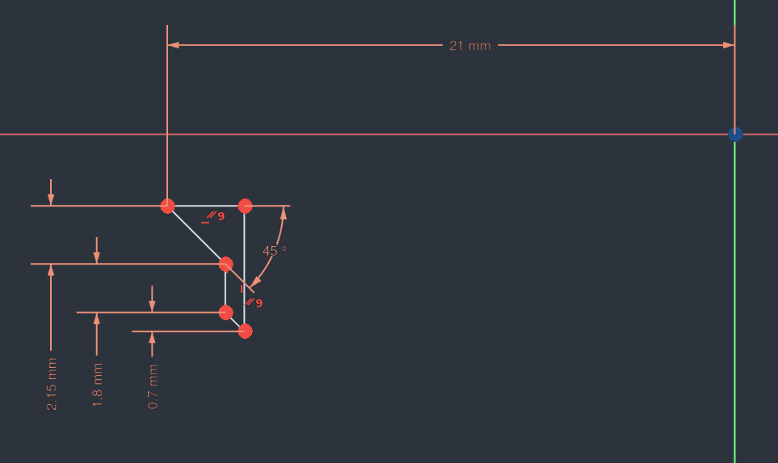
    * Constrain Profile til X-axis
      * Klik **Constrain Coincident** 
        * Klik Øverste linies højre endpunkt og x-axis over den
        * Profilen er nu fully constrained
    * 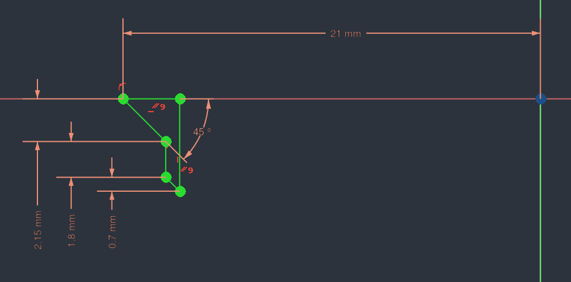
    * Press ** ComboView -> Task -> Close**

### Step 2.3: Tegn BasePlate Foot CutOut Profile

* DobbeltKlik på **ComboView -> Opgave_3 -> Part -> BasePlateProfile** så BasePlateProfile bliver det Aktive Body.
  * Klik på Iconet **Create Sketch** 
    * DobbeltKlik **ComboView -> Task -> XY-plane001 (Base plane)**
    * Press **ComboView -> Task -> Close**
  * Omdøb **Sketch002** til ***BasePlateFootCutOutProfile***
  * DobbeltKlik **ComboView -> Model -> Part -> BasePlateFootCutOutProfile**
    * Klik på Iconet **Centered Regtangle** 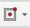
      * Check **ComboView -> Task -> Rectangle parameters -> Rounded corners** Eller Press [U]
      * Placer nu den **Centered Regtangle** med centrum i Nulpunket og giv den runde hjørner
      * 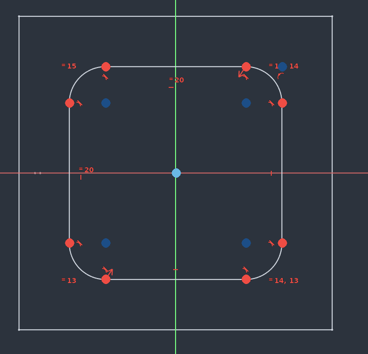
      * Constrain **Centered Rectangle med runde hjørner**
        * Klik på Iconet **ConstrainEqual** 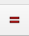, Klik nu på en Vandret & en Lodret linie for at få en Kvardrat med runde hjørner
        * Vælg Dimensions værktøjet 
          * Klik et af de runde hjørnet og **Insert radius** åbner klik nu på globusen og Indtast i **VarSet.GridOuterRadius** i **Expression editoren**
            * Result: 5,00 mm
          * Klik [Ok], [Ok]
        * Klik på Ikonet **Isometric**  eller press [1] for Isometric view
          * Vælg nu Ikonet **Create External Geometry** 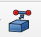
          * Klik på den øverste skrå linie i profilen, og der kommer 2 runde prikke på x-axis
          * 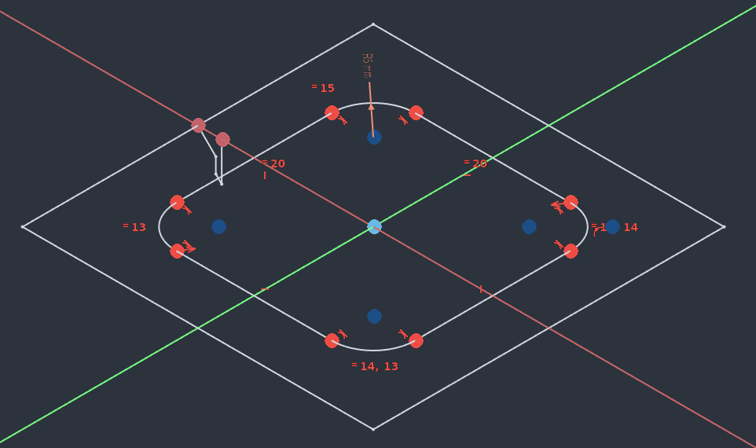
        * Væg nu Top View, brug terningen eller Press [2]
          * 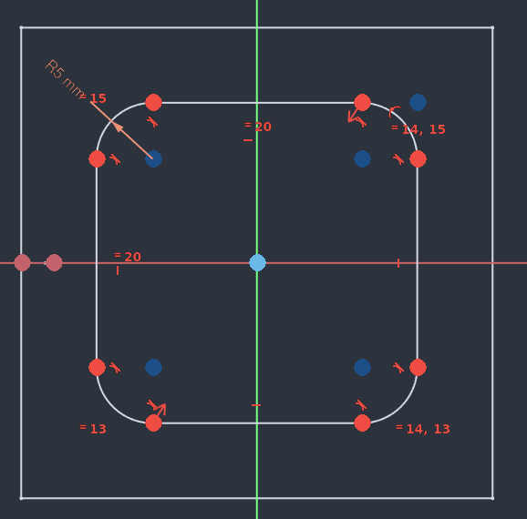
          * Klik **Constrain Coincident** 
          * Klik på Kvardraten højre lodrette linie, og **Create External Geometry** højre punkt.
          * Kvadraten er nu fully constrain
          * 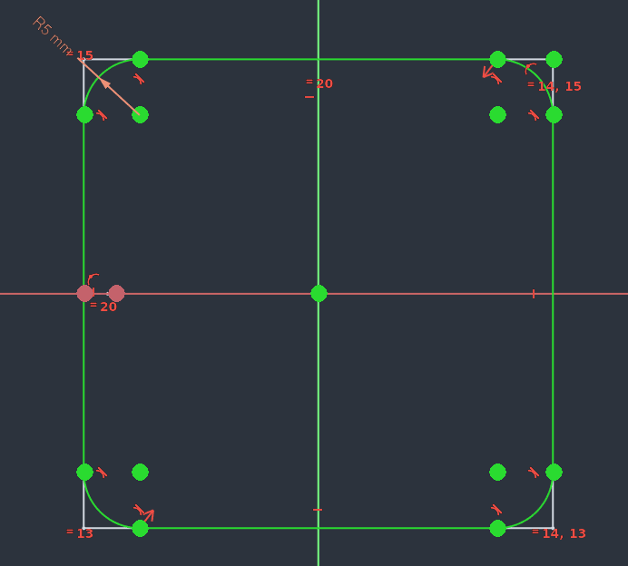
    * Press ** ComboView -> Task -> Close**
* Klik på Ikonet **Isometric**  eller press [1] for Isometric view
* 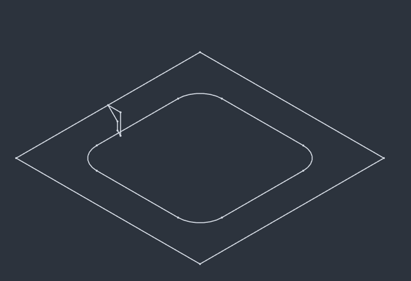

### Step 2.4: Tegn BasePlate Foot Pad Profile

* DobbeltKlik på **ComboView -> Opgave_3 -> Part -> BasePlateProfile** så BasePlateProfile bliver det Aktive Body.
  * Klik på Iconet **Create Sketch** 
    * DobbeltKlik **ComboView -> Task -> XY-plane001 (Base plane)**
    * Press **ComboView -> Task -> Close**
  * Omdøb **Sketch001** til ***BasePlateFootPadProfile***
  * DobbeltKlik **ComboView -> Model -> Part -> BasePlateFootPadProfile**
    * Klik på Iconet **Centered Regtangle** 
      * Placer nu den **Centered Regtangle** med centrum i Nulpunket
      * Constrain Kvardrat:
        * Klik på Iconet **ConstrainEqual** , Klik nu på en Vandret & en Lodret linie for at få en Kvardrat ud af firkanten
        * Klik på Ikonet **Isometric**  eller press [1] for Isometric view
          * 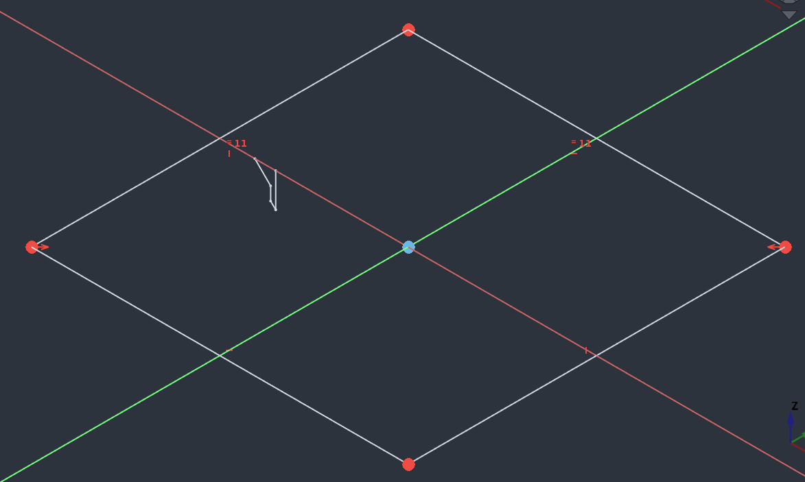
          * Vælg nu Ikonet **Create External Geometry** 
          * Klik på den øverste skrå linie i profilen, og der kommer 2 runde prikke på x-axis
          * 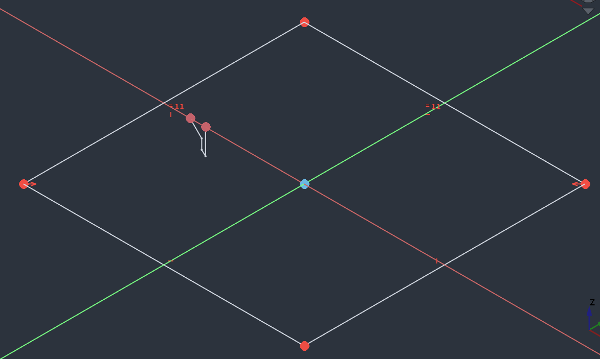
        * Væg nu Top View, brug terningen eller Press [2]
          * 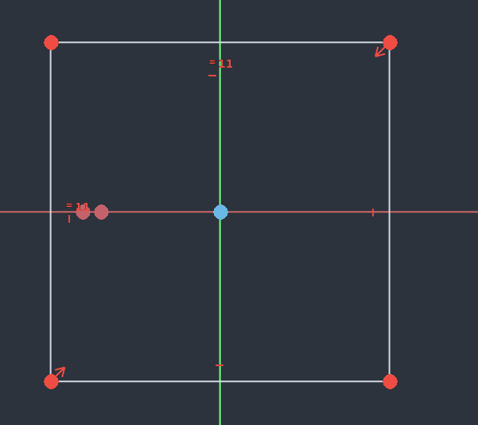
          * Klik **Constrain Coincident** 
          * Klik på Kvardraten højre lodrette linie, og **Create External Geometry** højre punkt.
          * Kvadraten er nu fully constrain
          * 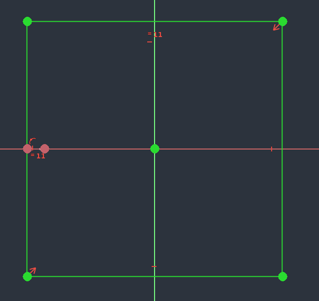
    * Press **ComboView -> Task -> Close**

### Step 2.5: Pad BasePlate Foot Profile

* DobbeltKlik på **ComboView -> Opgave_3 -> Part -> BasePlateProfile** så BasePlateProfile bliver det Aktive Body.
  * Marker **ComboView -> Opgave_3 -> Part -> BasePlateFootPad**
  * Vælg **Pad værktæjet** 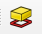
  * Sæt Pad parameters:
    * Length:
      * Tryk på Globus, og indsæt i **Expression Editor** 
        * **VarSet.GridProfileBaseplateHeight**
          * Result skal være 4.65 mm
    * Check Reversed
    * 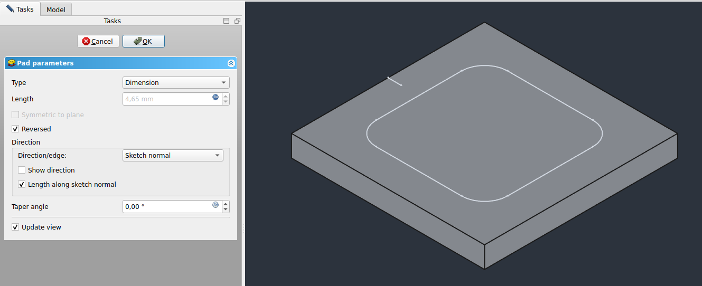
* 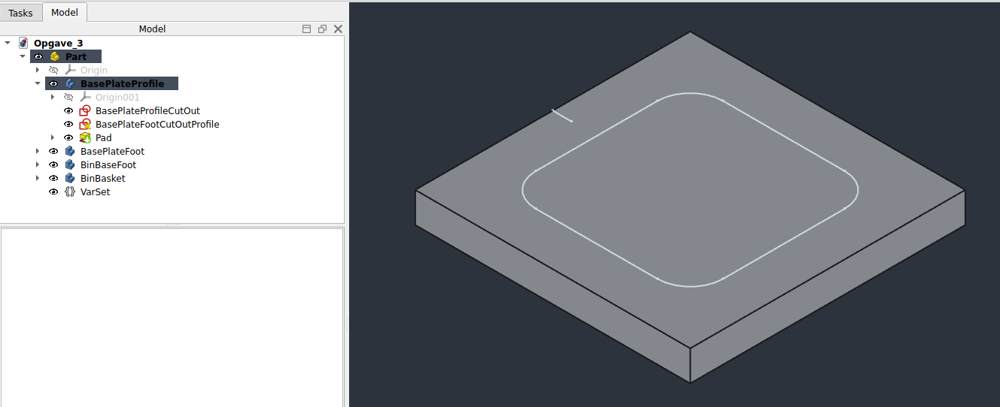