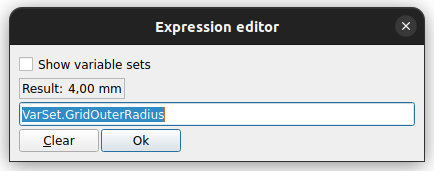

# Opgave 3a - Gridfinity Baseplate

## Kilder

* [Printables]()
  * [Gridfinity Specification](https://www.printables.com/model/417152-gridfinity-specification "grizzie17")
  * [Rugged Box (Parametric)](https://www.printables.com/model/258431-rugged-box-parametric "Whity")
* [Kursus Videoer](https://www.youtube.com/@sekt1953)
  * [GridFinity med FreeCAD , Opgave 3.0.0](https://youtu.be/Ei-lbytCaw4?list=PLIsjLuvJr7uiC1ekw9g8pa87OetihKBv0) *New 20241112 15:50*
  * [GridFinity med FreeCAD , Opgave 3.0.1](https://youtu.be/2Wk4Gov4X80?list=PLIsjLuvJr7uiC1ekw9g8pa87OetihKBv0) *New 20241112 15:52*
  * [GridFinityParametricFiles - BasePlate](https://youtu.be/zOC_qxB1Kig)
* Youtube Videoer
  * [GridFinity Parametric File #freecad #cad #design](https://youtu.be/rAv9zGpiyvw "Adventures in creation")
  * [Gridfinity in the Machine Shop: 3D Printed Metrology Toolbox Organization](https://youtu.be/RYA0xLryF-g)
  * [Underware: The Ultimate Cable Management System | Full Guide](https://youtu.be/0TT96b98YZY?list=PLFa9atYEuNhVEwJW1WDg2C_DJdGSHJGrQ "Hands On Katie")
  * [gridfinity case with bins](https://www.youtube.com/watch?v=hjQqcGHjv50 "Jason Brain")

## VarSet Data

|**Gridfinity Parameters:**||||
|:---|:---|:---|---:|
|Name|Group|Type|Value|
|GridSize|Gridfinity|App::PropertyLength| 42,00 mm|
|GridOuterRadius|Gridfinity|App::PropertyLength| 4,00 mm|
|**Gridfinity Profile:**||||
|GridProfileAngle|Gridfinity|App::PropertyAngle|45,00 deg|
|GridProfileTop|Gridfinity|App::PropertyLength| 2,15 mm|
|GridProfileMiddle|Gridfinity|App::PropertyLength| 1,80 mm|
|GridProfileLower|Gridfinity|App::PropertyLength| 0,70 mm|
|GridProfileHeight|Gridfinity|App::PropertyLength| GridProfileTop + GridProfileMiddle + GridProfileLower|
|||||
|**BasePlate Parameters:**|||***2 x 3 Grid***|
|BasePlateGridX|Baseplate|App::PropertyInteger|2|
|BasePlateGridY|Baseplate|App::PropertyInteger|3|
|||||
|**Bin Parameters:**|||***1 x 2 Grid***|
|BinOffset|Bin|App::PropertyLength| 0,25 mm|
|||||
|**BinFoot Parameters:**|||***1 x 2 Grid***|
|BinPlateGridX|BinFoot|App::PropertyInteger|1|
|BinPlateGridY|BinFoot|App::PropertyInteger|2|

## Step1: Opret 1 Part, 4 Body & 1 VarSet

* Åben FreeCAD i **Part Design**
  * Gem FreeCAD File: **File -> SaveAs** i ***~/DataStuen41/Opgaver/Opgave_3a/Opgave_3a.FCStd***
* Select ComboView -> Model
* Model View:
  * Klik på Iconet **Create Part** 
  * BasePlate:
    * Klik på Iconet **Create Body** 
      * Klik på [F2] for at omdøbe **Body** til ***BasePlate***
    * Klik på Iconet **Create Body** 
      * Klik på [F2] for at omdøbe **Body** til ***BasePlateFoot***
  * Basket:
    * Klik på Iconet **Create Body** 
      * Klik på [F2] for at omdøbe **Body** til ***BasketFoot***
    * Klik på Iconet **Create Body** 
      * Klik på [F2] for at omdøbe **Body** til ***BasketBucket***
    * Klik på Iconet **Create Body** 
      * Klik på [F2] for at omdøbe **Body** til ***BasketBucketInsert***
  * VarSet
    * Marker **ComboView -> Model -> Opgave_3 -> Part**
      * Klik på Iconet **Varset** 
      * Klik [Cancel]
* 

## Step 2.1 BasePlate - Indtast Variabler i VarSet

* DobbeltKlik ComboView -> Model -> Part -> Varset
  * Add Parameter til VarSet:
    * Checkmark:  **Add another**
      * Indtast:
        * Name: GridSize
        * Group: Gridfinity
        * Type: App::PropertyLength
        * Value: 42,00 mm
        * Klik [Ok]
      * Indtast:
        * Name: GridOuterRadius
        * Group: Gridfinity
        * Type: App::PropertyLength
        * Value: 4,00 mm
        * Klik [Ok]
      * Indtast:
        * Name: GridProfileAngle
        * Group: Gridfinity
        * Type: App::PropertyAngle
        * Value: 45,00 deg
        * Klik [Ok]
      * Indtast:
        * Name: GridProfileTop
        * Group: Gridfinity
        * Type: App::PropertyLength
        * Value: 2,15 mm
        * Klik [Ok]
      * Indtast:
        * Name: GridProfileMiddle
        * Group: Gridfinity
        * Type: App::PropertyLength
        * Value: 1,80 mm
        * Klik [Ok]
      * Indtast:
        * Name: GridProfileBaseplateLower
        * Group: Gridfinity
        * Type: App::PropertyLength
        * Value: 0,70 mm
        * Klik [Ok]
      * Indtast:
        * Name: GridProfileBaseplateHeight
        * Group: Gridfinity
        * Type: App::PropertyLength
        * Klik [Ok]
      * **HøjreKlik ComboView -> Model -> Gridfinity -> Grid Profile Baseplate Height**
        * Klik **Expression...** og Expression editor åbner
          * Indtsat nu **GridProfileTop + GridProfileMiddle + GridProfileBaseplateLower**
            * Result: 4,65
          * 
          * Klik [Ok]
      * Indtast:
        * Name: BasePlateGridX
        * Group: Baseplate
        * Type: App::PropertyInteger
        * Value: 2
        * Klik [Ok]
      * Indtast:
        * Name: BasePlateGridY
        * Group: Baseplate
        * Type: App::PropertyInteger
        * Value: 3
        * Klik [Ok]
* 

## Step 2.2 BasePlate - Tegn BasePlate Cut XZ-Profile

* Højre Klik -> ComboView -> Model -> Part -> Baseplate
  * Checkmark **Active Body**
* DobbeltKlik -> **ComboView -> Opgave_3 -> Part -> BasePlate** 
  * så BasePlateProfile bliver det Aktive Body.
* Klik på Iconet **Create Sketch** 
  * DobbeltKlik ComboView -> Task -> **XZ-plane001 (Base plane)**
  * Vælg -> ComboView -> **Model**
  * Omdøb **Sketch** til **BasePlateProfileXZCutOut**
  * DobbeltKlik på ComboView -> Opgave_3 -> Model -> **BasePlateProfileCutOut**
    * for at åbne Sketch for i edit mode
    * Vælg værktøjet **Create Polyline** 
      * For at tegne figuren, som er vist herunder:
    * 
  * Constrain Sketch:
    * Klik Ikonet **Constrain Horizontal/vertical**  eller klik **[A]**, Constrain nu lodret og vandrette linier.
    * Klik Ikonet **Constrain parallel**  eller klik **[P]**, og Constrain nu de to skrå linier.
    * Klik på en Ikonet **Dimension**  eller Klik [D]
      * Indsæt GridProfileAngle:
        * klik på en vandret & skrå linie, Vinduet **insert Angle** åbner, Klik den lille Globus og **Expression editor** vinduet åbner
        * 
        * Indtast nu **VarSet.GridProfileAngle**
          * Result skal være: 45,00 deg
        * Klik [Ok], [Ok]
    * Press [I] for [Constain Vertical distance:](https://wiki.freecad.org/Sketcher_ConstrainDistanceY)
      * Indsæt GridProfileTop:
        * Klik endpunkter for den øverste skrå linie
        * Klik den lille Globus og **Expression editor** vinduet åbner
        * 
          * Indtast nu **VarSet.GridProfileTop**
            * Result skal være: 2,15 mm
        * Klik [Ok], [Ok]
      * Indsæt GridProfileMiddle:
        * Klik nederste endpunkt for den øverste skrå linie, og det øverste endpunkt af den nederste skrå linie
        * Klik på den venstre lodrette Linie
        * Klik den lille Globus og **Expression editor** vinduet åbner
        * 
          * Indtast nu **VarSet.GridProfileMiddle**
            * Result skal være: 1,80 mm
        * Klik [Ok], [Ok]
      * Indsæt GridProfileBaseplateLower:
        * Klik endepunkt for den nesderste skrå linie
        * Klik den lille Globus og **Expression editor** vinduet åbner
        * 
          * Indtast nu **VarSet.GridProfileLower**
            * Result skal være: 0,70 mm
        * Klik [Ok], [Ok]
      * Press [L] for [Constain Horizontal distance:](https://wiki.freecad.org/Sketcher_ConstrainDistanceX)
        * Indsæt GridSize:
          * Klik øverste linies **venstre endepunkt** og **Sketchens nulpunket**.
          * Klik den lille Globus og **Expression editor** vinduet åbner
          * 
            * Indtast nu **VarSet.GridSize / 2**
              * Result skal være: 21,00 mm
          * Klik [Ok], [Ok]
        * 
      * Press [C] for [Constrain Coincident Unified:](https://wiki.freecad.org/Sketcher_ConstrainCoincidentUnified)
        * Constrain Profile til X-axis
          * Klik Øverste linies venstre endpunkt og x-axis over den
          * Profilen er nu fully constrained
        * 
    * Press **ComboView -> Task -> Close**

## Step 2.3 BasePlate - Tegn BasePlate Cut XY-Profile

* Klik på Iconet **Create Sketch** 
  * DobbeltKlik ComboView -> Task -> **XZ-plane001 (Base plane)**
  * Vælg -> ComboView -> **Model**
    * Omdøb **Sketch001** til **BasePlateProfileXYCutOut**
    * DobbeltKlik **ComboView -> Model -> Part -> BasePlateProfileXYCutOut**
    * Press [0] for Isometric View
      * Brug værktøjet [Create External Geometry](https://wiki.freecad.org/Sketcher_External)   
    for at få oprette link til profilen fra forrige trin.
      * 
    * Press [2] for Top View
      * Klik på Iconet **Centered Regtangle** 
        * Check **ComboView -> Task -> Rectangle parameters -> Rounded corners** Eller Press [U]
        * Placer nu den **Centered Regtangle** med centrum i Nulpunket og giv den runde hjørner
        * Constrain **Centered Rectangle med runde hjørner**
        * Klik på Iconet **ConstrainEqual** , Klik nu på en Vandret & en Lodret linie for at få en Kvardrat med runde hjørner
        * Vælg Dimensions værktøjet 
          * Klik et af de runde hjørnet og **Insert radius** åbner klik nu på globusen
          * 
            * Indtast i **VarSet.GridOuterRadius** i **Expression editoren**
              * Result: 4,00 mm
          * Klik [Ok], [Ok]
        * Placer nu den venstre lodrette symetrisk omkring 'External Geometry' Venstre punkt
          * Marker de 2 endepunkter af venstre lodrette linie, og det venstre punkt i 'External Geometry'
          og Klik Symmetric , Eller Press [S] for at Symmetri.
    * 
    * Press **ComboView -> Task -> Close**
* 

## Step 2.4 BasePlate - Tegn BasePlate XY-Profile

* Klik på Iconet **Create Sketch** 
  * DobbeltKlik ComboView -> Task -> **XZ-plane001 (Base plane)**
  * Vælg -> ComboView -> **Model**
    * Omdøb **Sketch002** til **BasePlateProfileXY**
    * DobbeltKlik **ComboView -> Model -> Part -> BasePlateProfileXY**
    * Press [0] for Isometric View
      * Brug værktøjet [Create External Geometry](https://wiki.freecad.org/Sketcher_External)  
      for at få oprette link til profilen fra forrige trin.
      * Klik Nederste venstre hjørner
      * Klik Øverste lodrette linie i XZ-Profilen
      * 
    * Press [2] for Top View
      * Klik på Iconet **Centered Regtangle** 
        * Check **ComboView -> Task -> Rectangle parameters -> Rounded corners** Eller Press [U]
        * Placer nu den **Centered Regtangle** med centrum i Nulpunket og giv den runde hjørner
        * Constrain **Centered Rectangle med runde hjørner**
        * [Constrain ConstrainEqual:](https://wiki.freecad.org/Sketcher_ConstrainEqual)
          * Klik på Iconet **ConstrainEqual** ,
          * Klik nu på en Vandret & en Lodret linie for at få en Kvardrat med runde hjørner
        * [Constrain Symmetric:](https://wiki.freecad.org/Sketcher_ConstrainSymmetric)
          * Marker de 2 endepunkter af venstre lodrette linie, og det Højrepunkt punkt i 'External Geometry'
          * Klik Symmetric , Eller Press [S] for at Symmetri.
          * 
        * [constraint coincident:](https://wiki.freecad.org/Sketcher_ConstrainCoincidentUnified)
          * Marker centrum af de 2 runde hjørner nederst til venstre
          * Klik [constraint coincident:](https://wiki.freecad.org/Sketcher_ConstrainCoincidentUnified) 
          * 
      * Klik på Iconet **Centered Regtangle** 
        * Placer nu den **Centered Regtangle** med centrum i Nulpunket
        * Constrain **Centered Rectangle**
          * Klik på Iconet **ConstrainEqual** ,
          * Klik nu på en Vandret & en Lodret linie for at få en Kvardrat med runde hjørner
        * Constrain **Horizontal/vertical:**
          * Klik på Iconet **Horizontal/vertical** ,
          * Marker nederste venstre hjørne i og et punkt i **External Geometry** Nederste venster hjørne
          * 
    * Press **ComboView -> Task -> Close**

## Step 2.5 BasePlate - Pad BasePlate XY-Profile & Klipvæk XZ-Profile

* [Pad Sketch](https://wiki.freecad.org/PartDesign_Pad) **BasePlateProfileXY**
  * Marker Sketch **BasePlateProfileXY**
    * Klik Pad Ikonet 
      * Klik den lille globus ud for PropertyLength,
        * Indtast: **VarSet.GridProfileHeight**
          * Result: 4,65 mm 
      * 
    * sæt flueben i **Reversed**
      * Klik [Ok]
    * 
* [Subtractive pipe:](https://wiki.freecad.org/PartDesign_SubtractivePipe)
  * Marker **BasePlateProfileXZCutOut** Hold [Ctrl] nede mens du Marker **BasePlateProfileXYCutOut**
  * Klik [Subtractive pipe](https://wiki.freecad.org/PartDesign_SubtractivePipe)
    * Klik [Ok]
  * 

## Step 2.6 BasePlate - Create MultiTransform

* ComboView -> Model -> Part -> Baseplate
  * Marker **Pad** & **SubtractivePipe**
    * Klik [**Create MultiTransform**](https://wiki.freecad.org/PartDesign_MultiTransform) Ikonen 
  * ComboView -> Model -> Multitransform Parameters -> Transformations
    * HøjreKlik og vælg [**Add linear pattern**](https://wiki.freecad.org/PartDesign_LinearPattern)
    * Sæt:
      * Direction: **Base X axis**
      * Mode: **Offset**
      * Offset: Klik den lille globus
        * Indtast: **VarSet.GridSize**
        *  
      * Occurrences: Klik den lille globus
        * Indtast **VarSet.BasePlateGridX**
        * Klik [Ok]
        * 
      * Klik [OK]
    * HøjreKlik og vælg [**Add linear pattern**](https://wiki.freecad.org/PartDesign_LinearPattern)
    * Sæt:
      * Direction: **Base Y axis**
      * Mode: **Offset**
      * Offset: Klik den lille globus
        * Indtast: **VarSet.GridSize**
        * 
      * Occurrences: Klik den lille globus
        * Indtast **VarSet.BasePlateGridY**
        * Klik [Ok]
        * 
      * Klik [OK]
  * 
    * Klik [Ok]
* 
  * 2x3 Gridfinity Grid Baseplate
