# Opgave 3 - Gridfinity

## VarSet Data

|**Gridfinity Parameters:**||||
|:---|:---|:---|---:|
|Name|Group|Type|Value|
|GridSize|Gridfinity|App::PropertyLength| 42,00 mm|
|GridOuterRadius|Gridfinity|App::PropertyLength| 4,00 mm|
|**Gridfinity Profile:**||||
|GridProfileAngle|Gridfinity|App::PropertyAngle|45,00 deg|
|GridProfileTop|Gridfinity|App::PropertyLength| 2,15 mm|
|GridProfileMiddle|Gridfinity|App::PropertyLength| 1,80 mm|
|GridProfileLower|Gridfinity|App::PropertyLength| 0,70 mm|
|GridProfileHeight|Gridfinity|App::PropertyLength| GridProfileTop + GridProfileMiddle + GridProfileLower|
|||||
|GridProfileBinLower|Gridfinity|App::PropertyLength| 0,x0 mm|
|GridProfileBinplateHeight|Gridfinity|App::PropertyLength| GridProfileTop +GridProfileMiddle + GridProfileBinLower|
|GridProfileBinTopRadius|Gridfinity|App::PropertyLength| 5,00 mm|
|||||
|**BasePlate Parameters:**|||***2 x 3 Grid***|
|BasePlateGridX|Baseplate|App::PropertyInteger|2|
|BasePlateGridY|Baseplate|App::PropertyInteger|3|
|||||
|**BinBasket Parameters:**|||***1 x 1 Grid***|
|BinPlateGridX|Baseplate|App::PropertyInteger|1|
|BinPlateGridY|Baseplate|App::PropertyInteger|1|
|**BinBasket Parameters:**|||***1 x 3 Grid***|
|BinPlateGridX|Baseplate|App::PropertyInteger|1|
|BinPlateGridY|Baseplate|App::PropertyInteger|3|
|**BinBasket Parameters:**|||***2 x 3 Grid***|
|BinPlateGridX|Baseplate|App::PropertyInteger|2|
|BinPlateGridY|Baseplate|App::PropertyInteger|3|

## Step1: Opret 1 Part, 4 Body & 1 VarSet

* Åben FreeCAD i **Part Design**
  * Gem FreeCAD File: **File -> SaveAs** i ***~/DataStuen41/Opgaver/Opgave_3a/Opgave_3a.FCStd***
* Select ComboView -> Model
* Model View:
  * Klik på Iconet **Create Part** 
  * BasePlate:
    * Klik på Iconet **Create Body** 
      * Klik på [F2] for at omdøbe **Body** til ***BasePlate***
    * Klik på Iconet **Create Body** 
      * Klik på [F2] for at omdøbe **Body** til ***BasePlateFoot***
  * Basket:
    * Klik på Iconet **Create Body** 
      * Klik på [F2] for at omdøbe **Body** til ***BasketFoot***
    * Klik på Iconet **Create Body** 
      * Klik på [F2] for at omdøbe **Body** til ***BasketBucket***
    * Klik på Iconet **Create Body** 
      * Klik på [F2] for at omdøbe **Body** til ***BasketBucketInsert***
  * VarSet
    * Marker **ComboView -> Model -> Opgave_3 -> Part**
      * Klik på Iconet **Varset** 
      * Klik [Cancel]
* 

## Step 2.1 BasePlate - Indtast Variabler i VarSet

* DobbeltKlik ComboView -> Model -> Part -> Varset
  * Add Parameter til VarSet:
    * Checkmark:  **Add another**
      * Indtast:
        * Name: GridSize
        * Group: Gridfinity
        * Type: App::PropertyLength
        * Value: 42,00 mm
        * Klik [Ok]
      * Indtast:
        * Name: GridOuterRadius
        * Group: Gridfinity
        * Type: App::PropertyLength
        * Value: 4,00 mm
        * Klik [Ok]
      * Indtast:
        * Name: GridProfileAngle
        * Group: Gridfinity
        * Type: App::PropertyAngle
        * Value: 45,00 deg
        * Klik [Ok]
      * Indtast:
        * Name: GridProfileTop
        * Group: Gridfinity
        * Type: App::PropertyLength
        * Value: 2,15 mm
        * Klik [Ok]
      * Indtast:
        * Name: GridProfileMiddle
        * Group: Gridfinity
        * Type: App::PropertyLength
        * Value: 1,80 mm
        * Klik [Ok]
      * Indtast:
        * Name: GridProfileBaseplateLower
        * Group: Gridfinity
        * Type: App::PropertyLength
        * Value: 0,70 mm
        * Klik [Ok]
      * Indtast:
        * Name: GridProfileBaseplateHeight
        * Group: Gridfinity
        * Type: App::PropertyLength
        * Klik [Ok]
      * **HøjreKlik ComboView -> Model -> Gridfinity -> Grid Profile Baseplate Height**
        * Klik **Expression...** og Expression editor åbner
          * Indtsat nu **GridProfileTop + GridProfileMiddle + GridProfileBaseplateLower**
            * Result: 4,65
          * 
          * Klik [Ok]
* 

## Step 2.2 BasePlate - Tegn BasePlate XZ-Profile

* Højre Klik -> ComboView -> Model -> Part -> Baseplate
  * Checkmark **Active Body**
* DobbeltKlik -> **ComboView -> Opgave_3 -> Part -> BasePlate** 
  * så BasePlateProfile bliver det Aktive Body.
* Klik på Iconet **Create Sketch** 
  * DobbeltKlik ComboView -> Task -> **XZ-plane001 (Base plane)**
  * Vælg -> ComboView -> **Model**
  * Omdøb **Sketch** til **BasePlateProfileXZCutOut**
  * DobbeltKlik på ComboView -> Opgave_3 -> Model -> **BasePlateProfileCutOut**
    * for at åbne Sketch for i edit mode
    * Vælg værktøjet **Create Polyline** 
      * For at tegne figuren, som er vist herunder:
    * 
  * Constrain Sketch:
    * Klik Ikonet **Constrain Horizontal/vertical** 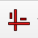 eller klik **[A]**, Constrain nu lodret og vandrette linier.
    * Klik Ikonet **Constrain parallel**  eller klik **[P]**, og Constrain nu de to skrå linier.
    * Klik på en Ikonet **Dimension**  eller Klik [D]
      * Indsæt GridProfileAngle:
        * klik på en vandret & skrå linie, Vinduet **insert Angle** åbner, Klik den lille Globus og **Expression editor** vinduet åbner
        * 
        * Indtast nu **VarSet.GridProfileAngle**
          * Result skal være: 45,00 deg
        * Klik [Ok], [Ok]
    * Press [I] for [Constain Vertical distance:](https://wiki.freecad.org/Sketcher_ConstrainDistanceY)
      * Indsæt GridProfileTop:
        * Klik endpunkter for den øverste skrå linie
        * Klik den lille Globus og **Expression editor** vinduet åbner
        * 
          * Indtast nu **VarSet.GridProfileTop**
            * Result skal være: 2,15 mm
        * Klik [Ok], [Ok]
      * Indsæt GridProfileMiddle:
        * Klik nederste endpunkt for den øverste skrå linie, og det øverste endpunkt af den nederste skrå linie
        * Klik på den venstre lodrette Linie
        * Klik den lille Globus og **Expression editor** vinduet åbner
        * 
          * Indtast nu **VarSet.GridProfileMiddle**
            * Result skal være: 1,80 mm
        * Klik [Ok], [Ok]
      * Indsæt GridProfileBaseplateLower:
        * Klik endepunkt for den nesderste skrå linie
        * Klik den lille Globus og **Expression editor** vinduet åbner
        * 
          * Indtast nu **VarSet.GridProfileLower**
            * Result skal være: 0,70 mm
        * Klik [Ok], [Ok]
      * Press [L] for [Constain Horizontal distance:](https://wiki.freecad.org/Sketcher_ConstrainDistanceX)
        * Indsæt GridSize:
          * Klik øverste linies **venstre endepunkt** og **Sketchens nulpunket**.
          * Klik den lille Globus og **Expression editor** vinduet åbner
          * 
            * Indtast nu **VarSet.GridSize / 2**
              * Result skal være: 21,00 mm
          * Klik [Ok], [Ok]
        * 
      * Press [C] for [Constrain Coincident Unified:](https://wiki.freecad.org/Sketcher_ConstrainCoincidentUnified)
        * Constrain Profile til X-axis
          * Klik Øverste linies venstre endpunkt og x-axis over den
          * Profilen er nu fully constrained
        * 
    * Press **ComboView -> Task -> Close**

## Step 2.3 BasePlate - Tegn BasePlate XY-Profile

* Klik på Iconet **Create Sketch** 
  * DobbeltKlik ComboView -> Task -> **XZ-plane001 (Base plane)**
  * Vælg -> ComboView -> **Model**
    * Omdøb **Sketch001** til **BasePlateProfileXYCutOut**
    * DobbeltKlik **ComboView -> Model -> Part -> BasePlateProfileXYCutOut**
    * Klik på Iconet **Centered Regtangle** 

## Stop her, jeg har kun rettet hertil !!!

      * Check **ComboView -> Task -> Rectangle parameters -> Rounded corners** Eller Press [U]
      * Placer nu den **Centered Regtangle** med centrum i Nulpunket og giv den runde hjørner
      * 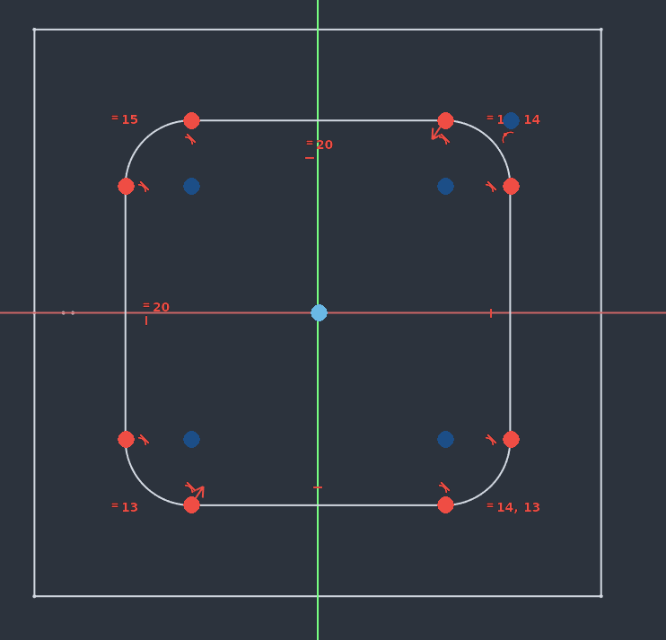
      * Constrain **Centered Rectangle med runde hjørner**
        * Klik på Iconet **ConstrainEqual** , Klik nu på en Vandret & en Lodret linie for at få en Kvardrat med runde hjørner
        * Vælg Dimensions værktøjet 
          * Klik et af de runde hjørnet og **Insert radius** åbner klik nu på globusen og Indtast i **VarSet.GridOuterRadius** i **Expression editoren**
            * Result: 5,00 mm
          * Klik [Ok], [Ok]
        * Klik på Ikonet **Isometric**  eller press [1] for Isometric view
          * Vælg nu Ikonet **Create External Geometry** 
          * Klik på den øverste skrå linie i profilen, og der kommer 2 runde prikke på x-axis
          * 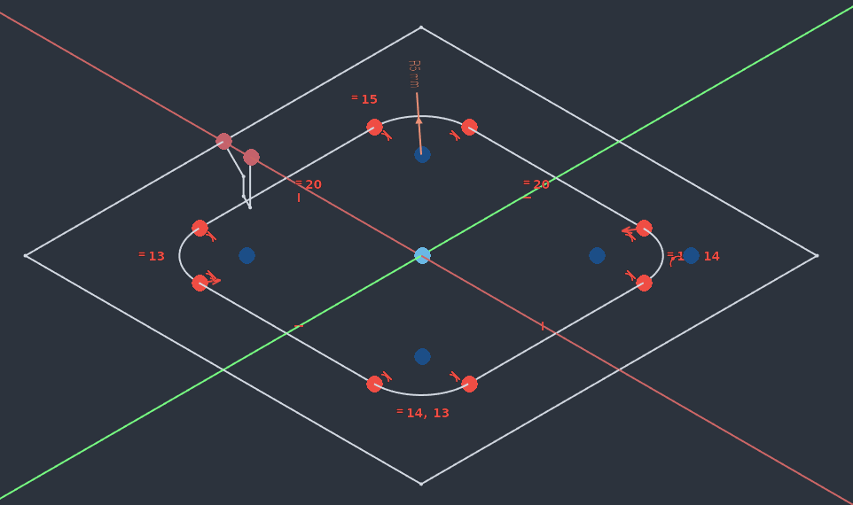
        * Væg nu Top View, brug terningen eller Press [2]
          * 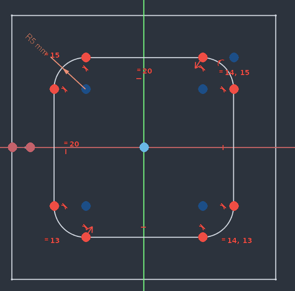
          * Klik **Constrain Coincident** 
          * Klik på Kvardraten højre lodrette linie, og **Create External Geometry** højre punkt.
          * Kvadraten er nu fully constrain
          * 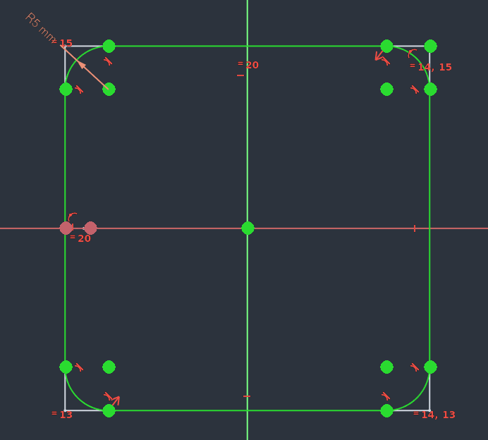
    * Press ** ComboView -> Task -> Close**
* Klik på Ikonet **Isometric**  eller press [1] for Isometric view
* 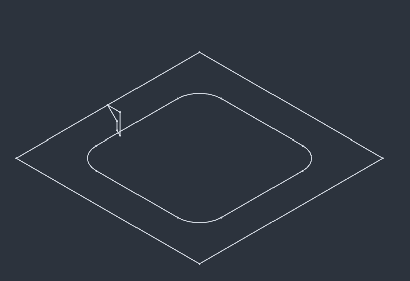

### Step 2.4: Tegn BasePlate Foot Pad Profile

* DobbeltKlik på **ComboView -> Opgave_3 -> Part -> BasePlateProfile** så BasePlateProfile bliver det Aktive Body.
  * Klik på Iconet **Create Sketch** 
    * DobbeltKlik **ComboView -> Task -> XY-plane001 (Base plane)**
    * Press **ComboView -> Task -> Close**
  * Omdøb **Sketch001** til ***BasePlateFootPadProfile***
  * DobbeltKlik **ComboView -> Model -> Part -> BasePlateFootPadProfile**
    * Klik på Iconet **Centered Regtangle** 
      * Placer nu den **Centered Regtangle** med centrum i Nulpunket
      * Constrain Kvardrat:
        * Klik på Iconet **ConstrainEqual** , Klik nu på en Vandret & en Lodret linie for at få en Kvardrat ud af firkanten
        * Klik på Ikonet **Isometric**  eller press [1] for Isometric view
          * 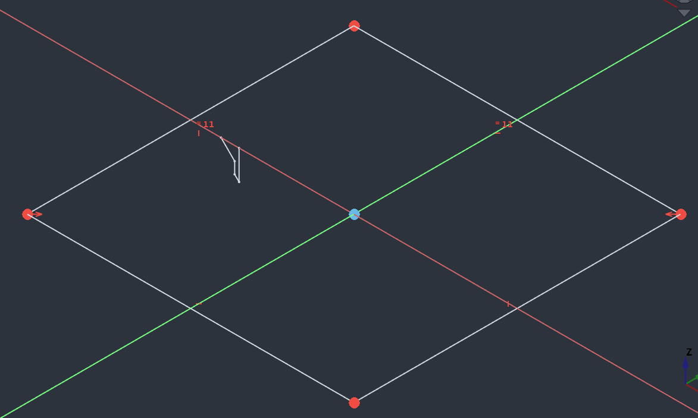
          * Vælg nu Ikonet **Create External Geometry** 
          * Klik på den øverste skrå linie i profilen, og der kommer 2 runde prikke på x-axis
          * 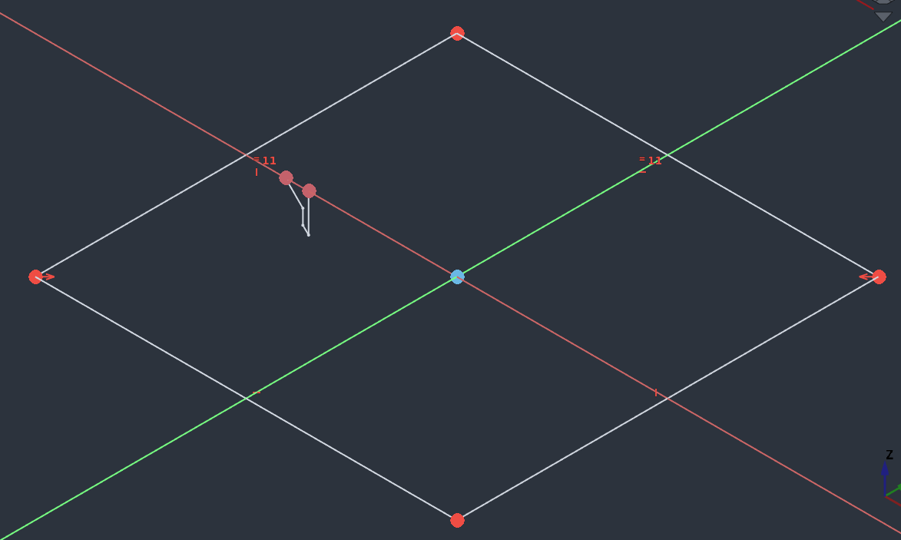
        * Væg nu Top View, brug terningen eller Press [2]
          * 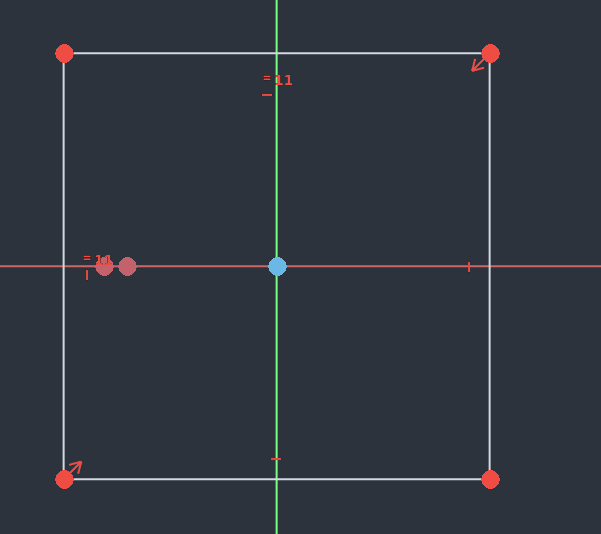
          * Klik **Constrain Coincident** 
          * Klik på Kvardraten højre lodrette linie, og **Create External Geometry** højre punkt.
          * Kvadraten er nu fully constrain
          * 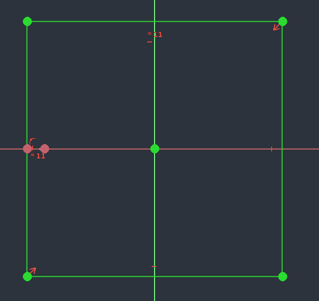
    * Press **ComboView -> Task -> Close**

### Step 2.5: Pad BasePlate Foot Profile

* DobbeltKlik på **ComboView -> Opgave_3 -> Part -> BasePlateProfile** så BasePlateProfile bliver det Aktive Body.
  * Marker **ComboView -> Opgave_3 -> Part -> BasePlateFootPad**
  * Vælg **Pad værktæjet** 
  * Sæt Pad parameters:
    * Length:
      * Tryk på Globus, og indsæt i **Expression Editor** 
        * **VarSet.GridProfileBaseplateHeight**
          * Result skal være 4.65 mm
    * Check Reversed
    * 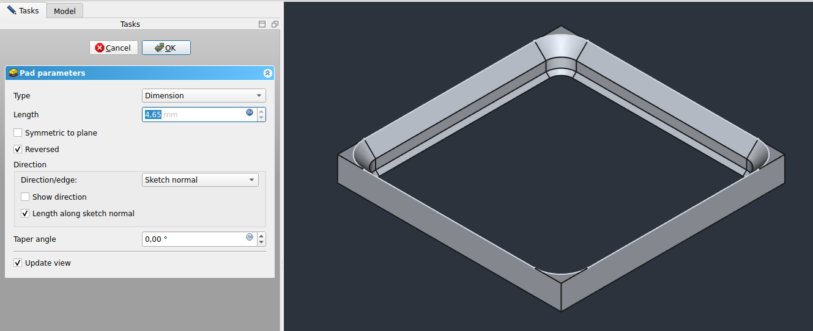
* 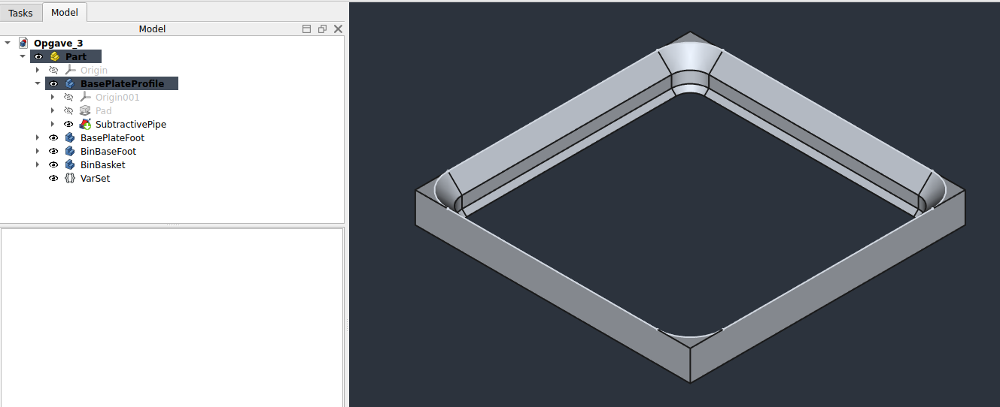