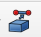
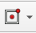
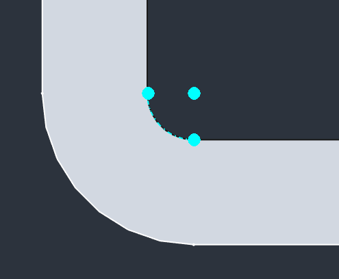
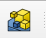
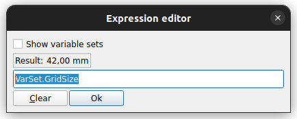

# Opgave 3c - Gridfinity BasketFoot

## Kilder

* [Printables]()
  * [Gridfinity Specification](https://www.printables.com/model/417152-gridfinity-specification "grizzie17")
  * [Rugged Box (Parametric)](https://www.printables.com/model/258431-rugged-box-parametric "Whity")
* [Kursus Videoer](https://www.youtube.com/@sekt1953)
  * [GridFinityParametricFiles - BasePlate](https://youtu.be/zOC_qxB1Kig)
* Youtube Videoer
  * [GridFinity Parametric File #freecad #cad #design](https://youtu.be/rAv9zGpiyvw "Adventures in creation")
  * [Underware: The Ultimate Cable Management System | Full Guide](https://youtu.be/0TT96b98YZY?list=PLFa9atYEuNhVEwJW1WDg2C_DJdGSHJGrQ "Hands On Katie")
  * [gridfinity case with bins](https://www.youtube.com/watch?v=hjQqcGHjv50 "Jason Brain")

## VarSet Data

|**Gridfinity Parameters:**||||
|:---|:---|:---|---:|
|Name|Group|Type|Value|
|GridSize|Gridfinity|App::PropertyLength| 42,00 mm|
|GridOuterRadius|Gridfinity|App::PropertyLength| 4,00 mm|
|**Gridfinity Profile:**||||
|GridProfileAngle|Gridfinity|App::PropertyAngle|45,00 deg|
|GridProfileTop|Gridfinity|App::PropertyLength| 2,15 mm|
|GridProfileMiddle|Gridfinity|App::PropertyLength| 1,80 mm|
|GridProfileLower|Gridfinity|App::PropertyLength| 0,70 mm|
|GridProfileHeight|Gridfinity|App::PropertyLength| GridProfileTop + GridProfileMiddle + GridProfileLower|
|||||
|**BasePlate Parameters:**|||***2 x 3 Grid***|
|BasePlateGridX|Baseplate|App::PropertyInteger|2|
|BasePlateGridY|Baseplate|App::PropertyInteger|3|
|||||
|**Bin Parameters:**|||***1 x 2 Grid***|
|BinOffset|Bin|App::PropertyLength| 0,25 mm|
|||||
|**BinFoot Parameters:**|||***1 x 2 Grid***|
|BinPlateGridX|BinFoot|App::PropertyInteger|1|
|BinPlateGridY|BinFoot|App::PropertyInteger|2|

## Step 1 BinFoot - Indtast Variabler i VarSet

* DobbeltKlik ComboView -> Model -> Part -> Varset
  * Add Parameter til VarSet:
    * Checkmark:  **Add another**
      * Indtast:
        * Name: BinOffset
        * Group: Bin
        * Type: App::PropertyLength
        * Value: 0,25 mm
        * Klik [Ok]
      * Indtast:
        * Name: BinFootGridX
        * Group: BinFoot
        * Type: App::PropertyInteger
        * Value: 1
        * Klik [Ok]
      * Indtast:
        * Name: BinFootGridXY
        * Group: BinFoot
        * Type: App::PropertyInteger
        * Value: 2
        * Klik [Ok], [Cancel]
  * 

## Step 2 BinFoot - [Create a sub-object(s) shape binder](https://wiki.freecad.org/PartDesign_SubShapeBinder)

* Marker -> ComboView -> Model -> Part -> Baseplate
  * Klik [MellemrumsTangent] for at slukke for **Baseplate**
* Højre Klik -> ComboView -> Model -> Part -> BasketFoot
  * Checkmark **Active Body**
* DobbeltKlik -> **ComboView -> Opgave_3 -> Part -> BasketFoot**
  * så **BasketFoot** bliver det Aktive Body.
* Press [0] for IsometricView
  * Marker **BasePlateProfileXZCutOut** 
    * Klik Ikonet [SubSshapeBinder](https://wiki.freecad.org/PartDesign_SubShapeBinder)   
    og du har oprette **Binder**
  * Marker **BasePlateProfileXYCutOut**
    * Klik Ikonet [SubSshapeBinder](https://wiki.freecad.org/PartDesign_SubShapeBinder)   
    og du har oprette **Binder001**
  * 
* 

## Step 3 BinFoot - BinFoot Profiler

* XZ-Profile:
  * Klik på Iconet **Create Sketch** 
    * DobbeltKlik ComboView -> Task -> **XZ-plane003 (Base plane)**
    * Vælg -> ComboView -> **Model**
    * Omdøb **Sketch** til **BigFootProfileXZ**
    * DobbeltKlik på ComboView -> Opgave_3 -> Model -> **BigFootProfileXZ**
  * Opret CreateExternalGeometry:
    * Klik på Ikonet CreateExternalGeometry 
      * Klik midt på **Binder** to skrå linier
      * 
      * Klik [Close]
  * Tegn XZ-Profile
    * Sluk for ComboView -> Model -> Part -> BasketFoot -> **Binder**
      * 
    * Brug **CreatePolyline**  til at tegne profilen
      * 
    * Brug **Constrain Horizontal vertical**  til at sikre at lodrette og vandrette linier er sådan
    * Brug **ConstrainParallel**  til at sikre skrå linier er Parallel
    * Brug **Coincident**  til at sikre dig at profiler er sikret til X-Axis
    * Press [L] og og sæt afstanden mellem Binder og profilen
      * Klik den lille globus 
        * Indtast: **VarSet.BinOffset**
      * 
      * Klik [Ok],[Ok]
    * Press [H] og Horizontal Constrain den korte lodrette linie
    * Press [V] og Vertical Constrain den Lange lodrette linie
  * 
  * Klik ComboView -> Task -> **Close**
* XY-Profile:
  * Klik på Iconet **Create Sketch** 
    * DobbeltKlik ComboView -> Task -> **XY-plane003 (Base plane)**
    * Vælg -> ComboView -> **Model**
    * Omdøb **Sketch** til **BigFootProfileXY**
    * DobbeltKlik på ComboView -> Opgave_3 -> Model -> **BigFootProfileXY**
  * Opret CreateExternalGeometry:
    * Klik på Ikonet CreateExternalGeometry 
      * Klik midt på **Binder001** nederste venstre runde hjørne
      * Sluk for ComboView -> Model -> **Binder001**
      * Press [0] for IsometricView
      * Klik på Ikonet CreateExternalGeometry 
      * Klik midt på **BigFootProfileXZ** Øverste vandrette linie
  * 
  * Press [2] for TopView
    * Klik på Iconet **Centered Regtangle** 
      * Check **ComboView -> Task -> Rectangle parameters -> Rounded corners** Eller Press [U]
        * Placer nu den **Centered Regtangle** med centrum i Nulpunket og giv den runde hjørner
        * Constrain **Centered Rectangle med runde hjørner**
        * Klik på Iconet **ConstrainEqual** 
          * Klik nu på en Vandret & en Lodret linie for at få en Kvardrat med runde hjørner
        * Placer nu den venstre lodrette symetrisk omkring 'External Geometry' Venstre punkt
          * Marker de 2 endepunkter af venstre lodrette linie, og det venstre punkt i 'External Geometry'
          * Klik Symmetric , Eller Press [S] for at Symmetri.
        * 
        * Placer hjørnerne
          * Marker Hjørne Centrum for Kvareaten og 'External Geometry' fra XY planet
          * Klik **Coincident** 
        * 
    * Press **ComboView -> Task -> Close**
  * 
 
 ## Step 4 BinFoot - BinFoot [Additive pipe](https://wiki.freecad.org/PartDesign_AdditivePipe)

* [Additive pipe:](https://wiki.freecad.org/PartDesign_AdditivePipe) 
  * Hold [Ctrl] mens du Markerer ComboView -> Model -> BasketFoot 
    * **BigFootProfileXZ** og derefter **BigFootProfileXY** rækkefølgen er vigtig
  * Klik nu Ikonet **Additive pipe:** [Additive pipe](./Images/Icons/AdditivePipe.png) 
    * Klik [OK]
* 

## Step 5 BinFoot - BinFoot Infill

* Create Infill:
  * Opret Sketch **BigFootInfillXY**:
    * Klik på Iconet **Create Sketch** 
      * DobbeltKlik ComboView -> Task -> **XY-plane003 (Base plane)**
      * Vælg -> ComboView -> **Model**
      * Omdøb **Sketch** til **BigFootInfillXY**
      * DobbeltKlik på ComboView -> Opgave_3 -> Model -> **BigFootInfillXY**
    * Opret CreateExternalGeometry:
      * Klik på Ikonet CreateExternalGeometry 
        * Klik midt på den indre radius af nederste Venstre hjørne, Zoom iind hvis nødvendigt
          * 
    * Tegn den Indre profile:
      * Klik på Iconet **Centered Regtangle** 
        * Check **ComboView -> Task -> Rectangle parameters -> Rounded corners** Eller Press [U]
          * Placer nu den **Centered Regtangle** med centrum i Nulpunket og giv den runde hjørner
          * Constrain **Centered Rectangle med runde hjørner**
          * Klik på Iconet **ConstrainEqual** 
            * Klik nu på en Vandret & en Lodret linie for at få en Kvardrat med runde hjørner
          * Placer hjørnerne:
            * Marker et af Nederste Hjørne endpunkter og tilsvarende punkt på 'External Geometry' fra XY planet
            * Klik **Coincident** 
          * 
    * Press **ComboView -> Task -> Close**
  * Opret Sketch **BigFootInfillXZ**:
    * Klik på Iconet **Create Sketch** 
      * DobbeltKlik ComboView -> Task -> **XZ-plane003 (Base plane)**
      * Vælg -> ComboView -> **Model**
      * Omdøb **Sketch006** til **BigFootInfillXZ**
      * DobbeltKlik på ComboView -> Opgave_3 -> Model -> **BigFootInfillXZ**
    * Opret CreateExternalGeometry:
      * Press [0] for IsometricView
      * ComboView -> Model -> BasketFoot ->
        * Sluk for **AdditivePipe**
        * Åben op **AdditivePipe**
        * Tænd for **BigFootProfileXZ**
    * Klik på **Create External Geometry** Ikonen 
      * Klik på den **External Geometry's** Lange lodrette linie.
      * ComboView -> Model -> BasketFoot ->
        * Sluk for **BigFootProfileXZ**
      * 
      * Tegn nu en lodret streg hvor støttelinien er:
        * Klik på **CreateLine** Ikonet 
        * Klik på endpunkterne af støttelinien
        * 
      * Press **ComboView -> Task -> Close**
  * [Additive pipe:](https://wiki.freecad.org/PartDesign_AdditivePipe) 
    * Hold [Ctrl] mens du Markerer ComboView -> Model -> BasketFoot 
      * **BigFootInfillXY** og derefter **BigFootInfillXZ** rækkefølgen er vigtig
      * Klik nu Ikonet **Additive pipe:** [Additive pipe](./Images/Icons/AdditivePipe.png)
      * Klik [OK]
    * 

## Step 6 BinFoot - Create MultiTransform

* Multitransform:
  * Hold [Ctrl] nede mens du Markerer **AdditivePipe** & **AdditivePipe001**
    * Klik Ikonet **CreateMultitransform** 

  * ComboView -> Task -> Multitransform Parameters -> Transformations
    * HøjreKlik og vælg [**Add linear pattern**](https://wiki.freecad.org/PartDesign_LinearPattern)
    * Sæt:
      * Direction: **Base X axis**
      * Mode: **Offset**
      * Offset: Klik den lille globus
        * Indtast: **VarSet.GridSize**
        *  
      * Occurrences: Klik den lille globus
        * Indtast **VarSet.BinFootGridX**
        * Klik [Ok]
        * 
      * Klik [OK]
    * HøjreKlik og vælg [**Add linear pattern**](https://wiki.freecad.org/PartDesign_LinearPattern)
    * Sæt:
      * Direction: **Base Y axis**
      * Mode: **Offset**
      * Offset: Klik den lille globus
        * Indtast: **VarSet.GridSize**
        * 
      * Occurrences: Klik den lille globus
        * Indtast **VarSet.BinFootGridY**
        * Klik [Ok]
        * 
      * Klik [OK]
  * 
  * Klik [OK]
  * ComboView -> Model -> 
        * Tænd for **BasePlate**
* 