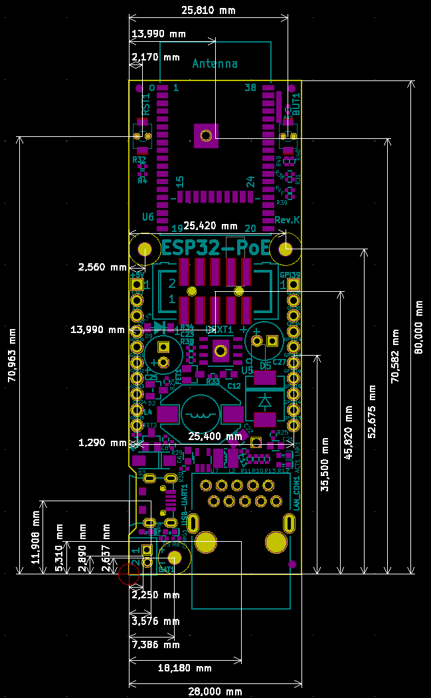

# OMJK

## SporskifteDriver_002

* 
  * Size: 140mm x 55mm
    * 55 pin : 55 x 2,54mm = 139,70mm
    * 22 pin : 43 x 1.27mm =  54,61mm
    * 22 pin : 22 x 0,635mm = mm
  * Hulafstand
    * Vandret : 53 x 2,54mm = 134,62mm
    * Lodret  : 12 x 2,54mm =  30,48mm
    * Offset  : 2,54mm + ( 3 * 0,635mm ) = 4,445mm
  * Brass Not HulSize:
    * M3*3*4,2 = 3,9mm
* 
* 

## MCP23017_300

* 
  * Size: 110mm x 40mm
    * 43 pin : 43 x 2,54mm = 109,22mm
    * 16 pin : 31 x 1,27mm =  39,37mm
  * Hulafstand
    * Vandret : 40 x 2,54mm = 48,26mm
    * Vandret : 40 x 2,54mm = 101,6mm
    * Offset  : 9 x 2,54mm = 22,86mmm -> 10 x 2,54mm = 25,4mmm
  * Brass Not HulSize:
    * M3*3*4,2 = 3,9mm
* 
* 

## ESP32-PoE-ISO

* 
  * Size: 98,15mm x 28mm
  * Brass Not HulSize:
    * M2*3*3,5 = 3,2mm
* 
* 

## ESP32-PoE

* 
  * Size: 80mm x 28mm
  * Brass Not HulSize:
    * M2*3*3,5 = 3,2mm
* 
* 

## BodyTest

* 
  * Offset :
    * SporskifteDriber -> MCP23017:
      * 16,5mm x 2mm
    * MCP23017 -> ESP32-PoE-Iso:
      * 2mm
* 
* 
* 
* 
* 
* 

### Slut resultat

* 
* 
  * [FreeCAD-File](./FreeCAD/BoxTest.FCStd)
  