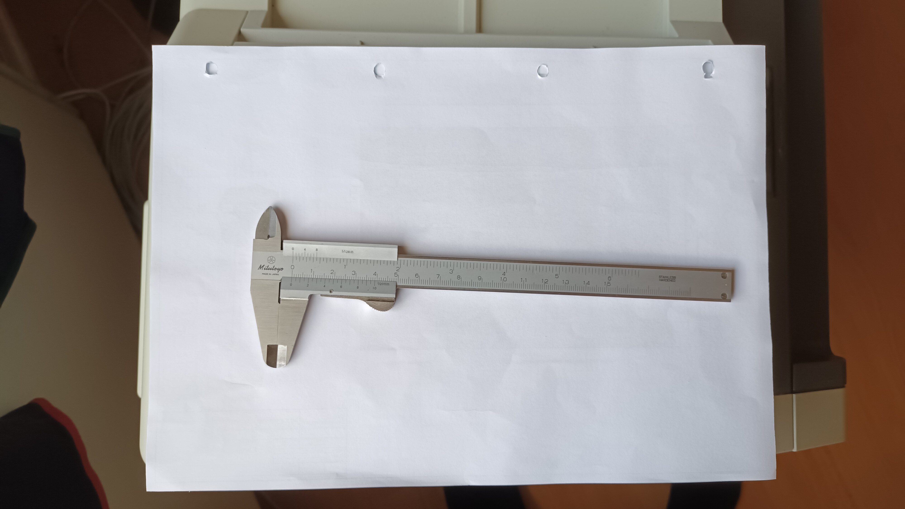

# Datastuen41-FreeCAD

Her vil jeg dele opgaver Tips og løsninger med deltager i Datastuen41 FreeCAD hold.

[Datastuen41,
Bøgeparken 41,
5792 Årslev,
Danmark](https://maps.app.goo.gl/i1MGUUs6uD3a9bza9)

* Kursus 2024-2025
  * FreeCAD 1.0.0 Installation
    * [Her henter jeg FreeCAD 1.0.0RCx](https://github.com/FreeCAD/FreeCAD/releases)
    * [Preferences settings vi bruger](./Preferences.md)
  * Lidt om at bruge Part Design, Sketcher og list om Constraints.
    * [YouTube Videoer vi vil bruge lidt tid på](./YouTube_Video_Links.md)
  * [Gevind](./Gevind/README.md)
  * [Tegne Opgaver:](./Opgaver/Opgaver.md)
* Kursus 2025-2026
  * Modifying STEP files
    * Video for Kursus [FreeCAD - Modifying STL STEP and 3MF files](https://youtu.be/5l6GOfshigQ?t=469 "RoadSide Maker")
    * [Modifying STEP and STL files](https://youtu.be/ahJnfMxFlL8 "MangoJelly Solutions for FreeCAD")
  * Generates Gridfinity Bins
    * [This FREE AI Tool Auto-Generates Gridfinity Bins!](https://youtu.be/e3EhJJlWwws)
      * 
      * [AI Gridfinity Generator: https://www.tooltrace.ai](https://www.youtube.com/redirect?event=video_description&redir_token=QUFFLUhqbHd3NEM4bGd0V004MEJpam9xbFQzbGZ0TGt0UXxBQ3Jtc0trNllhRzZVOVpoTlhWaDdUYnpQMXlnRGZyVTBNRHo4N1dlbzNmMndaSlg2NFl5c1cyR2R6TVNINllqRTV0cGFSX1VjV1lPQmxXWXRTa3RJRWVpTWdHTi0yNWs0c0tJbldQQTVQSFNXbm1KSjBiSlQ4cw&q=https%3A%2F%2Fwww.tooltrace.ai%2F&v=e3EhJJlWwws)
      * [shadowbox.3mf](./Images/shadowbox.3mf)
    * Video [Create 3D Model from image | Trace picture | Convert Image to 3D part](https://youtu.be/u8_NcxQP3mo "CAD CAM COURSE")
  * Arbejde med multi materiale og farver
    * kommer snart
* Test Værktøjer:
  * [Temperature-Tower & PruserSlicer](./Tools/temp-tower/TempTower.md)
* Octoprint - Er det noget jeg kan bruge?
  * [Windows](./Tools/Octoprint/OctoprintWin.md)
  * For Linux
