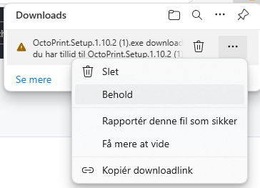
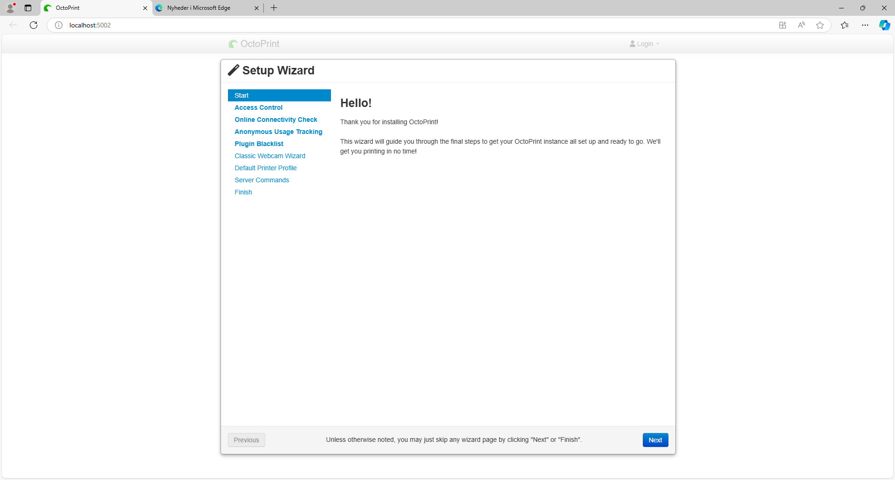
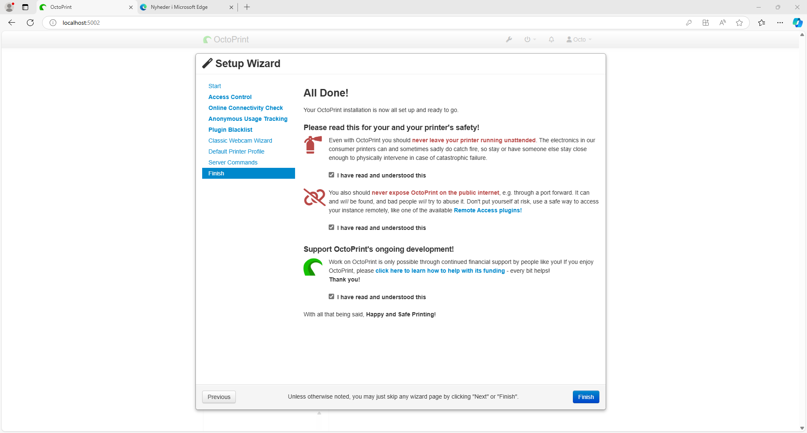

# Octoprint for Windows - Er det noget jeg kan bruge

## Bidrag af Anders Steen Hansen

## Ja, det er meget muligt. Der er en opgave at få flyttet data fra slicer til 3D printeren. 

## Hvordan flyttes tegning fra slicer til printer

## Oversigt:

SD Kort: Alle
WiFi: Det er ikke alle der understøtter dette.
USB: Printer skal stå inden for usb kabellængde til en computer
     og der skal bruges et Web program som der er som der er nogle at vælge imellem.
     Her har vi valgt at bruge Octoprint, det er Open Source,samt rimeligt nemt at bruge og kan overvåge dit print.

Web program
    • OctoPrint: Software til 3D Print
    • Duet: HW Software til 3D Print Kræver .net arm prosessor Raspberry Pi
    • Flashair: Software til 3D Print Kræver windows
    • Astro box: Box til 3D print
    • Reprtier: Software til 3D Print
    • MKS:  HW – Board – Touch - Opdatering
    Klipper
  
## Links sidst i dokumentet

### [Info til Octoprint](http://octoprint.org)

Octoprint kan installeres på mange platforme.
Windows, Linux-Ubuntu, Raspberri Pi, Mac, Docker, Proxmox,

### [Oversigt over alle installatione](https://octoprint.org/download/)

[windows installatio https://github.com/jneilliii/OctoPrint-WindowsInstaller/releases/download/1.10.2/OctoPrint.Setup.1.10.2.exe](https://github.com/jneilliii/OctoPrint-WindowsInstaller/releases/download/1.10.2/OctoPrint.Setup.1.10.2.exe)

### Installation for windows

[windows download](https://github.com/jneilliii/OctoPrint-WindowsInstaller)

[Windows vejledning](https://github.com/jneilliii/OctoPrint-WindowsInstaller)
* * *

* * *

### [Installation fil Octoprint.Setup.1.10.2.exe](https://github.com/jneilliii/OctoPrint-WindowsInstaller/releases/download/1.10.2/OctoPrint.Setup.1.10.2.exe)

# Billed vejledning til win install

[Installations fil](https://github.com/jneilliii/OctoPrint-WindowsInstaller/releases/download/1.10.2/OctoPrint.Setup.1.10.2.exe)

Billede mangler Vil du give tilladelse til at ...

## C:\OctoPrint\basedir\5002

## Installere

### Installation for Linux / Ubuntu 
### [Linux Vejledning](https://github.com/paukstelis/octoprint_deploy)

## Opsætning af Octoprint med Cura og Prusa

### Octoprint med Cura
Connect Octoprint skal installeres i Cura

Der skal installeres et API 

### Octoprint med Prusa

* Links:
  * [octoprint.org/](http://octoprint.org/)
  * [Repetier](https://www.repetier.com/)
  * [Duet3D](https://www.duet3d.com/)
  * [Klipper](https://support.dynabook.com/support/viewContentDetail?contentId=4006103)
  * [Astrobox](https://www.astroprint.com/astrobox-gateway)
  * [Makerbase](https://www.makerbase.store/)
  * [FlashAir](https://support.dynabook.com/support/viewContentDetail?contentId=4006103)

## Hvad er en port?
